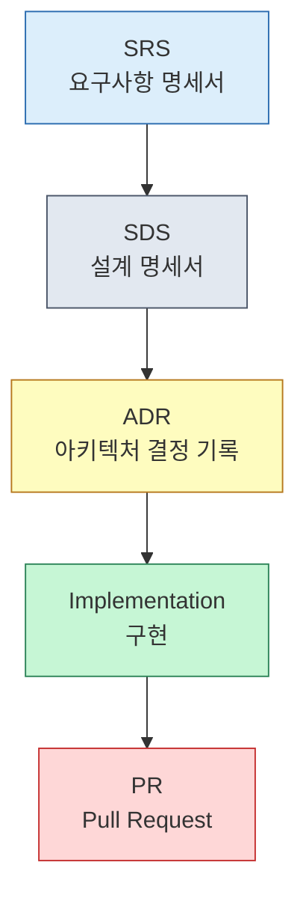

# Portfolio

## 1. 소개 (Introduction)
저는 코드를 통해 사고를 정리하던 개발자에서,  
구조를 문서로 설계하고 그 일관성을 코드로 실현하는 개발자로 성장했습니다.  
초기에는 코드 자체를 문서처럼 다루며 클린 코드의 철학에 집중했지만,  
프로젝트가 복잡해질수록 구조와 문서의 중요성을 깨닫게 되었습니다.  
지금은 모든 작업을 **SRS → SDS → ADR → 구현**의 문서 기반 프로세스로 진행하며,  
각 단계에서 의사결정의 이유와 결과를 명확히 기록합니다.  
저에게 개발은 기능을 만드는 일이 아니라 **논리적 구조를 세우는 일**이며,  
그 구조를 언어와 코드로 일관되게 표현하는 과정입니다.

자세한 자기소개는 [**self-introduction.md**](./resume/self-introduction.md) 문서에서 확인할 수 있습니다.

---

## 2. 개발 철학 (Development Philosophy)
코드는 결과물이지만, 구조는 사고의 표현이며  
문서는 그 질서를 언어로 남기는 수단이라고 생각합니다.  
명확성과 일관성, 예측 가능성을 가장 중요한 가치로 둡니다.

---

## 3. 작업 원칙 (Principles)
- 결정은 문서에서 시작해 코드로 검증한다.  
- 모듈 간 경계와 책임은 명시적으로 표현한다.  
- 가독성보다 이해 가능성을, 효율보다 구조적 일관성을 우선한다.  
- 실패와 복구 경로를 구조 내에 포함시킨다.

---

## 4. 문서 기반 프로세스 (Process)
프로젝트는 다음 순서로 진행됩니다.

1. **SRS (Software Requirements Specification)** – 요구사항 명세서  
   문제의 구조와 제약을 정의합니다.  
2. **SDS (Software Design Specification)** – 설계 명세서  
   모듈 경계, 의존성, 정책, 복구 전략을 설계합니다.  
3. **ADR (Architecture Decision Record)** – 아키텍처 결정 기록  
   설계 선택의 배경과 이유를 문서화합니다.  
4. **Implementation** – 구현  
   문서로 정의한 구조를 코드로 검증하고, 일관성을 유지합니다.  
5. **PR** – 코드 리뷰 및 문서 일관성 검증 단계입니다.

---

## 5. 문서 체계 (Documentation System)
모든 문서 템플릿은 `/docs/templates/` 디렉토리에 위치합니다.  
각 문서는 프로세스 단계에 대응하며, 서로 링크되어 구조적 일관성을 유지합니다.

| 구분 | 파일 경로 | 설명 |
|------|------------|------|
| **Root Issue** | [`root-issue-template.md`](./docs/templates/root-issue-template.md) | 상위 작업 관리용 이슈 템플릿 |
| **SRS** | [`srs-template.md`](./docs/templates/srs-template.md) | 요구사항 명세 및 범위 정의 |
| **SDS** | [`sds-template.md`](./docs/templates/sds-template.md) | 설계 명세 및 구조 정의 |
| **ADR** | [`adr-template.md`](./docs/templates/adr-template.md) | 아키텍처 결정 기록 |
| **Implementation** | [`implementation-template.md`](./docs/templates/implementation-template.md) | 구현 단위 이슈 템플릿 |
| **PR** | [`pr-template.md`](./docs/templates/pr-template.md) | 코드 변경 및 리뷰용 템플릿 |

---

## 6. 프로젝트 구조 (Project Overview)
| 구분 | 파일 경로 | 설명 |
|------|------------|------|
| **Relion** | [`relion.md`](./embedded/relion.md) | AP 장비 환경에 실제 탑재될 REST API 프로젝트  |
| **key fetcher** | [`key fetcher.md`](./embedded/key-fetcher.md) | 관리 프로토콜 암호화에 사용 될 암호화 key 교환 어플리케이션 |
| **oceancloud** | [`oceancloud.md`](./web/oceancloud.md) | 환경 데이터 수집 플랫폼 |

