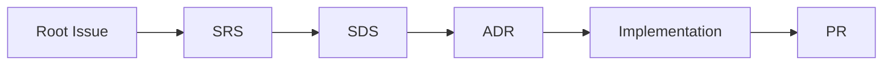

# 문서 템플릿과 작업 체계

작업은 아래 순서로 진행합니다.

Root Issue로 전체 작업 범위를 먼저 잡고, SRS에서 요구사항을 정리한 뒤 SDS로 설계를 구체화합니다.
설계 과정에서 선택이 필요한 지점은 ADR에 결정 배경과 이유를 남기고, 구현 단위 이슈로 나누어 작업합니다.
PR에서는 코드 변경과 함께 문서와 코드가 같은 방향을 가리키는지 확인합니다.

버그는 별도 트랙으로 처리하며, 재현 조건, 원인 분석, 수정 범위, 재발 방지까지 함께 기록합니다.

---

| 템플릿 | 설명 |
|---|---|
| [Root Issue](./root-issue-template.md) | 전체 작업 범위 추적 및 하위 이슈 연결 |
| [SRS](./srs-template.md) | 요구사항 명세 및 범위 정의 |
| [SDS](./sds-template.md) | 설계 명세 및 모듈 구조 정의 |
| [ADR](./adr-template.md) | 아키텍처 결정 배경과 이유 기록 |
| [Implementation](./implementation-template.md) | 구현 단위 이슈 |
| [PR](./pr-template.md) | 코드 변경 및 문서 일관성 검증 |
| [Bug](./bug-template.md) | 버그 재현, 원인 분석, 수정 설계, 재발 방지 |
