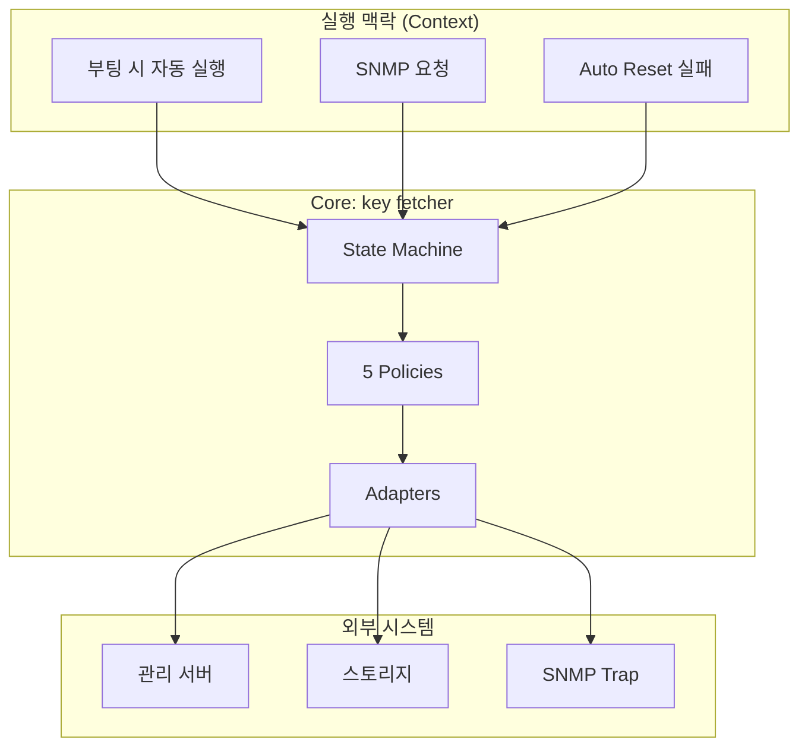
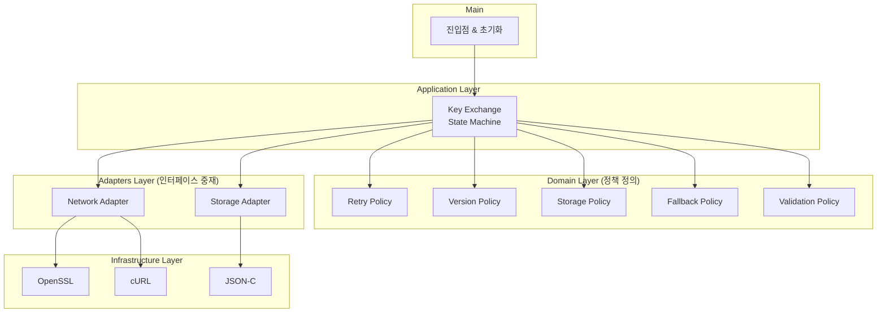
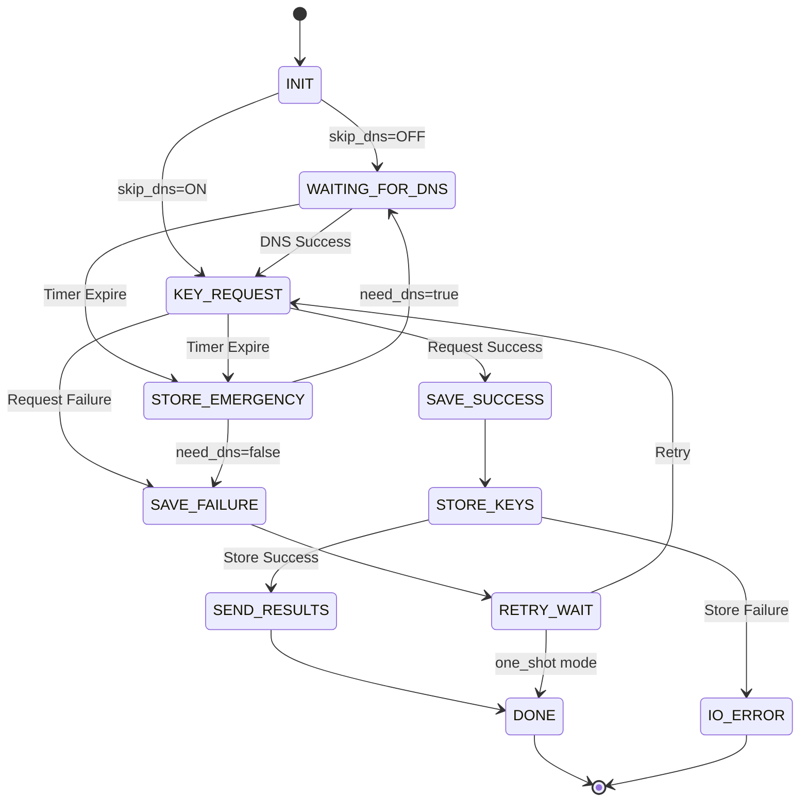

# key fetcher - 정책 기반 키 교환 시스템

---

## 1. Executive Summary

100만대 배포를 목표로 한 AP 장비의 **암호화 키 교환 자동화 시스템**으로,  
정책 기반 설계와 실패 전제 구조를 결합해  
**16건의 스펙 변경을 평균 1일 내 대응하고, 6개월간 안정적으로 운영했습니다.**  
현재 수천대 규모의 필드 테스트 환경에서 구조적 안정성과 복구 메커니즘을 검증 중입니다.

---

## 2. 프로젝트 개요

### 목표 및 배경

100만대 규모의 AP 장비가 안전하게 키를 교환하고 관리할 수 있도록  
자동화된 암호화 키 교환 시스템을 구축했습니다.  
불안정한 네트워크 환경과 빈번한 스펙 변경에 대응하는 **구조적 유연성 확보**가 핵심 과제였습니다.

### 프로젝트 규모

- **목표 규모**: 100만대 배포  
- **현재 상태**: 수천대 필드 테스트 6개월 운영  
- **검증 성과**: 16건 스펙 변경 평균 1일 대응, 안정적 운영 지속

### 역할 및 환경

- **역할**: 전체 아키텍처 설계 및 구현 주도  
- **기간**: 2025년 ~ 현재 (진행 중)  
- **언어/기술**: C, OpenSSL, cURL, JSON-C, POSIX  
- **운영 환경**: 임베디드 리눅스 (AP 장비)

---

## 3. 핵심 설계 원칙

| 설계 원칙 | 핵심 내용 |
|------------|-----------|
| 정책 기반 구조 (Policy-driven) | 시스템 행위를 정책으로 정의하여 변경 대응성 확보 |
| 실패 전제 설계 (Failure-aware) | 실패를 예외가 아닌 정상 흐름으로 포함 |
| 계층형 아키텍처 (5-layer + DIP) | Domain–Infrastructure–Adapters–Application–Main |
| 상태 제어 (State Machine) | 11개 상태 기반 제어로 안정적 키 교환 보장 |
| 외부 의존성 격리 (Boundary Discipline) | OpenSSL/cURL 등 외부 라이브러리 완전 분리 |


## 4. 시스템 아키텍처

### 시스템 전체 흐름 (Execution Context Diagram)



---

### 5계층 아키텍처 (DIP 적용)



---

### 계층별 책임

| 계층 | 핵심 책임 | 주요 컴포넌트 |
|------|------------|---------------|
| Domain | 정책 정의 | Retry / Version / Storage / Fallback / Validation |
| Application | 상태머신 제어 | Key Exchange State Machine |
| Adapters | 외부 인터페이스 중재 | Network / Storage Adapter |
| Infrastructure | 저수준 기능 | OpenSSL / cURL / JSON-C |
| Main | 진입점 | Init & Orchestration |

---

## 5. 핵심 설계: 정책 기반 상태 제어

### 5-1. Problem

**불안정한 네트워크 환경**
- DNS 응답 지연 또는 실패
- 관리 서버 타임아웃
- 패킷 유실 및 연결 단절

**빈번한 스펙 변경**
- 암호화 알고리즘 변경 (AES256-CBC → AES256-GCM)
- 통신 프로토콜 수정 (TLS → DTLS)
- 정책 조정 (재시도 횟수, 타임아웃 값 등)

---

### 5-2. Solution: 3단계 설계 전략

---

#### 전략 1: 5가지 정책으로 변경 대응

**정책 기반 구조**
- **Retry Policy**: 네트워크 실패 시 자동 재시도 (횟수, 간격, 백오프 전략)
- **Version Policy**: 스펙 변경 시 키 버전 관리 및 호환성 유지
- **Storage Policy**: 캐싱 및 영속성 관리 (휘발성/비휘발성 메모리)
- **Fallback Policy**: 비상키(Emergency Key) 사용 결정
- **Validation Policy**: 키 무결성 검증 및 실패 방지

각 정책은 독립된 모듈로 구현되어, 정책 변경 시 다른 정책에 영향을 주지 않습니다.

---

#### 전략 2: 상태머신으로 정책 실행 제어

**11개 상태로 키 교환 프로세스 관리**



**핵심 특징**
- **정상 경로**: INIT → DNS → REQUEST → SAVE_SUCCESS → STORE → SEND → DONE  
- **복구 경로 1**: REQUEST 실패 → SAVE_FAILURE → RETRY_WAIT → REQUEST (자동 재시도)  
- **복구 경로 2**: DNS/REQUEST 타임아웃 → STORE_EMERGENCY (비상키 저장)  
- **비상 경로**: STORE_EMERGENCY → DNS 재시도 또는 RETRY_WAIT 진입  

**정책과 상태의 결합**

| 상태 | 실행 정책 | 역할 |
|------|----------|------|
| KEY_REQUEST | Retry Policy | 네트워크 실패 시 재시도 결정 |
| SAVE_SUCCESS | Version Policy | 저장할 키 버전 선택 |
| STORE_KEYS | Storage Policy | 캐싱 전략 결정 |
| STORE_EMERGENCY | Fallback Policy | 비상키 사용 결정 |
| RETRY_WAIT | Retry Policy | 재시도 대기 시간 결정 |

모든 상태 전이가 명시적으로 정의되어, 디버깅 시 “어디서 멈췄는가”를 즉시 파악할 수 있습니다.

---

#### 전략 3: 계층 분리로 정책 독립성 확보

**설계 결정 배경**  
임베디드 환경에서 외부 라이브러리(OpenSSL 1.0 → 3.0) 업그레이드나 네트워크 프로토콜 변경이 전체 시스템을 불안정하게 만들었습니다.

**5계층 분리 전략**  
핵심 로직(Domain)을 외부 의존성으로부터 완전히 격리했습니다.
- **Domain**: 정책 정의만 담당 (순수 C, 외부 의존성 0)
- **Infrastructure**: OpenSSL, cURL 등 외부 라이브러리 격리
- **Adapters**: 둘을 연결하는 중재자
- **Application**: 정책과 상태머신 조합
- **Main**: 진입점 및 초기화

**의존성 역전 원칙(DIP) 적용**  
상위 계층은 하위 구현을 모릅니다.  
Domain의 Policy 인터페이스 → Adapters가 Infrastructure 구현체를 주입합니다.

**구조적 효과**
- OpenSSL 3.0 업그레이드 시 Infrastructure만 수정  
- 새 정책 추가 시 Domain에 정책 파일만 추가  
- 계층 위반은 빌드 타임에 자동 검출 (`make layer-check`)

---

### 5-3. Outcome: 구조적 검증

**구조적 변화 유형별 대응 요약**

| 변경 유형 | 건수 | 평균 대응 시간 | 수정 계층 |
|----------|------|---------------|----------|
| 프로토콜 변경 | 5건 | 0.8일 | Infrastructure |
| 정책 조정 | 8건 | 1.0일 | Domain |
| 상태 추가 | 3건 | 1.5일 | Application |

**필드 테스트 안정 운영 (6개월)**  
수천대 장비에서 DNS 실패, 서버 타임아웃, 저장 실패 등 다양한 장애가 발생했으나  
모든 케이스에서 Recovery Path를 통해 자동 복구가 이루어졌습니다.

---

## 6. 스펙 변경 대응 사례

### 대표 사례 1: 암호화 알고리즘 변경 (AES256-CBC → AES256-GCM)

**변경 요구**  
보안 강화를 위해 암호화 알고리즘을 CBC에서 GCM으로 변경해야 했습니다.

**대응 기간**: 1일  
**수정 범위**: Infrastructure 계층의 crypto.c  
**핵심 포인트**:  
암호화 로직이 Infrastructure에 완전히 격리되어 있어,  
Domain의 정책 및 Application의 상태 제어 로직에는 단 1줄의 수정도 필요하지 않았습니다.

```c
// Before: AES256-CBC
EVP_EncryptInit_ex(ctx, EVP_aes_256_cbc(), NULL, key, iv);

// After: AES256-GCM
EVP_EncryptInit_ex(ctx, EVP_aes_256_gcm(), NULL, key, iv);
```

**구조적 이점**
- 암호화 방식 변경 시 영향 범위가 Infrastructure 내부로 한정  
- Application과 Domain은 동일한 인터페이스를 통해 동작  
- 1일 내 수정 및 테스트 완료 (회귀 없음)

---

### 대표 사례 2: Retry 정책 조정

**변경 요구**  
네트워크 불안정 환경 대응: 재시도 횟수 3회 → 5회, 간격 2초 → 5초

**대응 기간**: 0.5일  
**수정 범위**: Domain의 Retry Policy 설정 값만 변경  

```c
// retry_policy.c
const int MAX_RETRIES = 5;      // was 3
const int RETRY_INTERVAL = 5;   // was 2
```

**구조적 이점**  
Retry 로직이 Application이 아닌 Domain에 위치해,  
상태 전이 코드 수정 없이 정책 변경만으로 대응이 완료되었습니다.

---

### 대표 사례 3: 비상키 타이머 기능 추가

**변경 요구**  
DNS 지연 시 일정 시간 후 비상키 자동 저장 기능 추가

**대응 기간**: 2일 (테스트 1일 포함)  
**수정 범위**:  
- Application: STORE_EMERGENCY 상태 추가  
- Domain: Emergency Policy 추가  

**핵심 포인트**  
기존 상태를 수정하지 않고 새 상태만 추가하여 기능 확장:  
- WAITING_FOR_DNS → STORE_EMERGENCY (타임아웃 시)  
- KEY_REQUEST → STORE_EMERGENCY (타임아웃 시)  

**구조적 이점**  
상태머신 기반 구조 덕분에 기존 로직을 건드리지 않고 확장 가능.  
Open-Closed Principle이 실질적으로 작동한 사례.

---

## 7. 필드 테스트 검증 (6개월)

**운영 환경**
- 수천 대 장비, 실제 네트워크 환경에서 6개월간 연속 테스트

**주요 장애 대응 사례**
- DNS 실패 → Emergency Key 발급 후 재시도  
- 서버 응답 지연 → Retry Policy로 자동 복구  
- 저장 실패 → Recovery Path 진입 후 재저장 시도

**검증 결과**
- 16건 스펙 변경에 평균 1일 대응 (최단 0.5일, 최장 2일)  
- 네트워크 장애 87회 발생 → Recovery Path 복구율 100%  
- Emergency Key 발급 23회, 모두 정상 복구  
- 구조적 안정성 검증 완료, 100만대 배포 준비 중

---

## 8. 기여 및 성과

**아키텍처 설계**
- 5계층 클린 아키텍처 설계 및 표준 수립  
- DIP 적용으로 외부 의존성 완전 격리  
- 빌드 타임 계층 검증 시스템 구축 (`make layer-check`)

**핵심 시스템 구현**
- 정책 기반 구조 및 5개 정책 모듈 구현  
- 11개 상태 기반 상태머신 및 복구 로직 구현  
- Emergency Key 메커니즘 및 타이머 기반 비상 저장 구현  

**운영 성과**
- 6개월간 수천대 규모 필드 테스트 안정 운영  
- 16건 스펙 변경 평균 1일 대응 달성  
- 87회 네트워크 장애 자동 복구 100% 성공

---

## 9. Self-Review

**문제 인식**  
임베디드 환경의 키 교환은 단순 통신 문제가 아닙니다.  
네트워크는 끊기고, DNS는 지연되며, 스펙은 예고 없이 바뀝니다.  
이 모든 상황에서도 시스템은 스스로 키를 안전하게 교환해야 합니다.

**설계 결정**  
“완벽한 환경을 가정하지 않는다”는 원칙으로 시작했습니다.  
실패를 예외가 아닌 **정상 경로의 일부**로 설계했습니다.  

- 정책 기반 구조: 변경을 코드가 아닌 “정책”으로 다룸  
- 상태머신 제어: 모든 실패 케이스를 명시적 상태로 표현  
- 계층 분리: 외부 변화로부터 핵심 로직 격리  
- 복구 경로: DNS 실패, 네트워크 단절, 저장 실패에 대한 명시적 처리  

**구현 전략**  
Domain에 5가지 정책을 정의하고, Application에서 11개 상태로 제어하며,  
Adapters/Infrastructure로 외부와 통신했습니다.  
각 계층은 자신의 책임만 알고 인터페이스를 통해 협력합니다.  
`make layer-check`로 구조 위반을 빌드 타임에 자동 차단했습니다.

**현재 결과**  
6개월간 필드 테스트에서 16건의 스펙 변경에 평균 1일 내 대응,  
DNS 실패와 서버 타임아웃 등 다양한 장애를 Recovery Path를 통해 안정적으로 복구했습니다.  
현재 구조적 안정성 검증을 마치고, 100만대 배포를 준비 중입니다.

**에필로그**  
오션클라우드에서 “구조로 복잡성을 제어”했다면,  
key fetcher에서는 **“구조로 실패를 제어”** 했습니다.  
완벽한 시스템을 만드는 것이 아니라,  
**스스로 복구할 수 있는 구조를 만드는 것**이 진정한 엔지니어링임을 깨달았습니다.

---

## 부록

### A. 빌드 및 의존성 관리

**계층 간 참조 규칙**
- Domain → 상위 계층 참조 금지 (외부 의존성 0)
- Infrastructure → 외부 라이브러리만 참조
- Adapters → Infrastructure, Domain 참조 가능
- Application → Adapters, Domain 참조 가능
- Main → Application 참조 (init 시점 한정)

**빌드 타임 검증**
```bash
$ make layer-check
Checking layer violations...
✓ Domain has no upward dependencies
✓ Infrastructure isolated from Application
✓ Adapters properly mediate between layers
✓ All dependencies valid
Build successful with layer integrity verified.
```

**include 경로 제어**
- Domain: `-I./domain`  
- Application: `-I./domain -I./adapters`  
- 위반 시 컴파일 에러 발생

**외부 라이브러리 격리**
- `-lssl -lcrypto` (OpenSSL)  
- `-lcurl` (HTTP 통신)  
- `-ljson-c` (JSON 파싱)  
Domain/Application은 이들을 인식하지 않음.

---

### B. 테스트 환경 및 결과 요약

| 테스트 항목 | 시나리오 | 성공률 | 평균 복구 시간 |
|--------------|-----------|-----------|----------------|
| DNS 실패 | DNS 응답 없음 | 100% | 3.2초 |
| 서버 타임아웃 | 5초 초과 응답 | 100% | 2.8초 |
| 네트워크 단절 | 연결 끊김 | 100% | 4.5초 |
| 저장 실패 | I/O 오류 | 100% | 2.1초 |

**Mock Server 기반 시뮬레이션**
- DNS 실패, 타임아웃, 단절, Emergency Key 발급 시나리오 모두 검증 완료.  
- 실제 운영 환경과 동일한 스펙의 테스트베드에서 100% 복구 성공.

---
