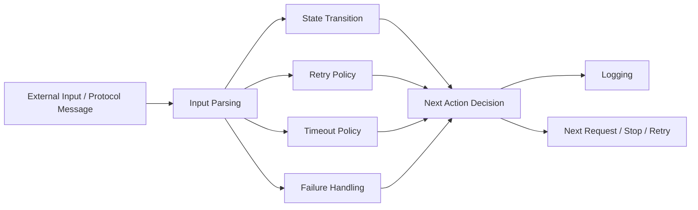
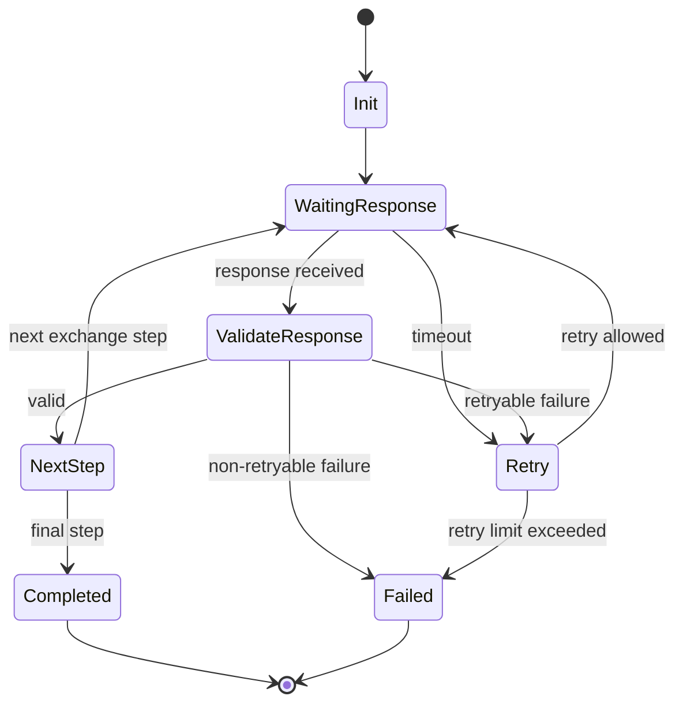

# Architecture

## 설계 목표

Key Fetcher는 키 교환 기능 자체보다, 반복되는 스펙 변경과 예외 상황에 대응할 때 수정 범위를 좁히고 문제 발생 지점을 추적할 수 있도록 설계한 시스템입니다.

핵심 목표는 다음과 같습니다.

- 상태 흐름과 정책 판단을 분리할 것
- 외부 입출력과 내부 판단을 분리할 것
- 실패를 예외가 아니라 흐름의 일부로 다룰 것
- 로그를 운영 추적 기준으로 남길 것

## 전체 구성

## 구성 요소

| 구성 요소            | 책임                        | 변경 시 영향 범위     |
| ---------------- | ------------------------- | -------------- |
| Input Parsing    | 외부 메시지를 내부 판단에 필요한 값으로 해석 | 메시지 형식 변경      |
| State Transition | 현재 단계와 다음 단계 전이 판단        | 단계 추가/변경       |
| Retry Policy     | 재시도 여부와 재시도 한계 판단         | 재시도 규칙 변경      |
| Timeout Policy   | 시간 초과 기준 판단               | timeout 기준 변경  |
| Failure Handling | 실패 종류 분류 및 중단 여부 판단       | 실패 정책 변경       |
| Logging          | 상태, 실패, 다음 판단 기록          | 로그 포맷/운영 기준 변경 |

## 설계 기준

### 1. 상태 흐름과 정책을 분리

키 교환은 단순한 요청-응답 처리보다, 현재 단계와 예외 조건에 따라 다음 동작이 달라지는 흐름에 가깝습니다.
그래서 다음 요소를 한 위치에 섞지 않고 분리했습니다.

* 상태 전이
* 재시도 판단
* 타임아웃 판단
* 실패 분류
* 로그 기록

이렇게 나누면 재시도 기준이 바뀌어도 상태 전이 전체를 수정하지 않고, timeout 기준이 바뀌어도 실패 처리까지 함께 건드리지 않도록 범위를 제한할 수 있습니다.

### 2. 외부 입출력과 내부 판단을 분리

외부 프로토콜 메시지 처리와 내부 상태 판단이 한 함수에 섞이면, 메시지 포맷 변경이 전체 흐름 수정으로 번지기 쉽습니다.
이를 막기 위해 아래 경계를 분리했습니다.

* 외부 입력 해석
* 내부 상태/정책 판단
* 다음 동작 결정
* 로그 기록

### 3. 실패를 흐름의 일부로 처리

실제 운영에서는 정상 응답보다 지연, 비정상 응답, retryable failure, timeout이 더 자주 문제가 됩니다.
그래서 실패를 마지막에 한 번 처리하는 방식이 아니라, 각 단계에서 아래를 구분하도록 설계했습니다.

* 재시도 가능한 실패
* 즉시 중단해야 하는 실패
* 시간 초과로 간주하는 경우
* 로그만 남기고 다음 판단으로 넘기는 경우

## 상태 흐름

## 변경 시나리오별 영향 범위

### 재시도 기준 변경

재시도 허용 횟수나 조건이 바뀌면 `Retry Policy` 중심으로 수정합니다.
상태 전이와 timeout 판단은 그대로 유지합니다.

### timeout 기준 변경

시간 초과 기준이 바뀌면 `Timeout Policy` 중심으로 수정합니다.
실패 분류나 로그 구조는 함께 수정하지 않도록 분리했습니다.

### 프로토콜 메시지 형식 변경

외부 메시지 구조가 바뀌면 `Input Parsing` 중심으로 대응합니다.
내부 상태 흐름과 retry/timeout 정책은 가능한 한 그대로 둡니다.

## 운영과 디버깅 관점

로그는 단순 출력이 아니라 상태 흐름을 추적하기 위한 근거로 사용했습니다.
운영 중에는 아래 질문에 답할 수 있어야 했습니다.

* 현재 어느 단계에 있었는가
* 왜 다음 단계로 가지 못했는가
* retry인지 종료인지 어떻게 결정되었는가
* timeout과 일반 실패를 어떻게 구분했는가

이 기준 덕분에 문제 발생 시 단순 실패 여부보다, 어느 단계에서 어떤 판단이 이루어졌는지를 기준으로 원인을 좁힐 수 있었습니다.

## 요약

Key Fetcher의 아키텍처는 다음 네 가지를 기준으로 정리했습니다.

* 상태 흐름과 정책 분리
* 외부 입출력과 내부 판단 분리
* 실패를 흐름의 일부로 처리
* 로그를 운영 추적 기준으로 사용

프로젝트 배경과 결과는 [Overview](./Overview.md) 문서에 정리했습니다.
