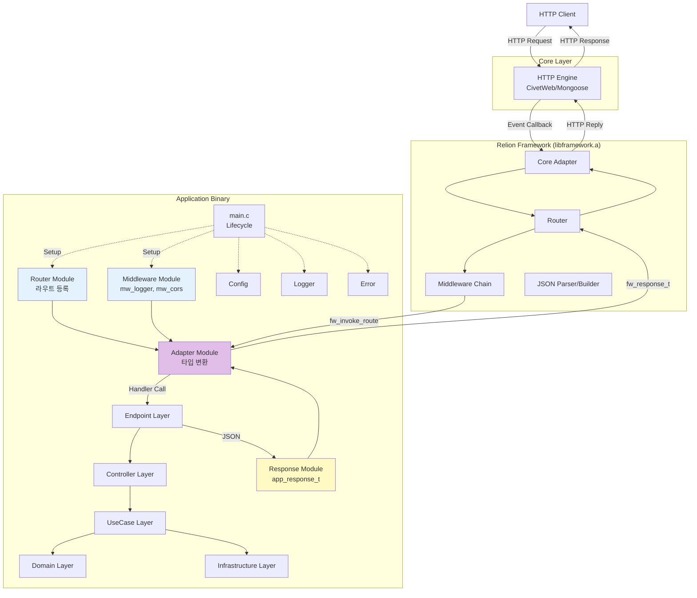
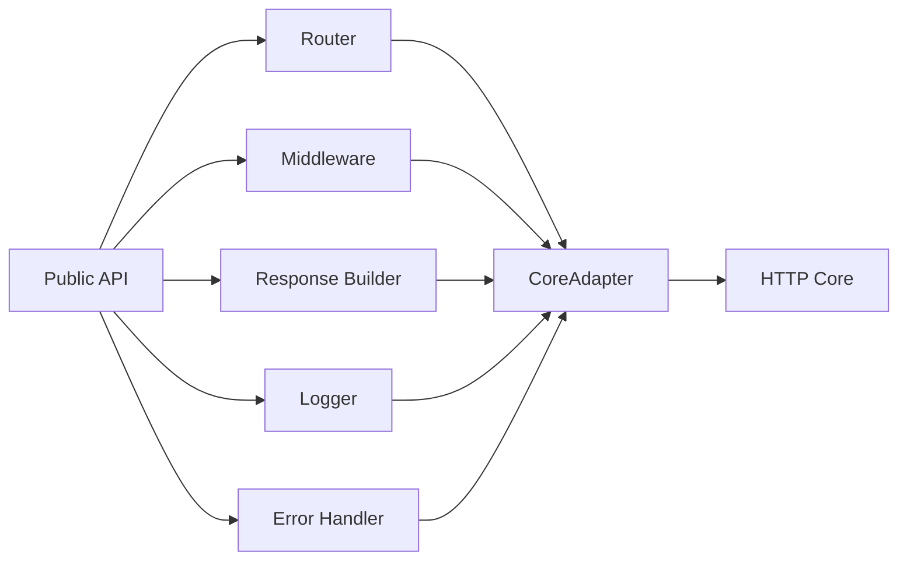
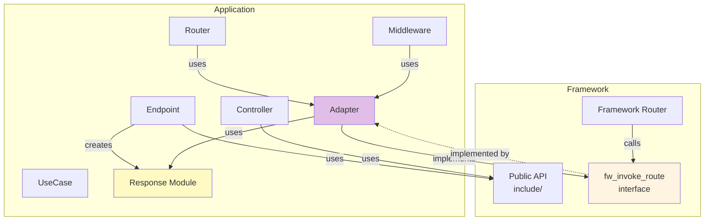

# Relion Framework

---

## 1. Executive Summary

Relion은 **AP 장비 환경에 실제 탑재될 REST API**로 개발 중인 프로젝트입니다.

C 언어 환경에서 Layered + Hexagonal 아키텍처를 완전 구현하여, Core-Framework-Application의 독립적 진화를 실현했습니다.

**개발 배경**

AP 장비가 외부 APC(AP Controller)와 통신하기 위해서는, 장비 내부에서 REST API 서버가 동작해야 했습니다. 이를 위해 초기에는 Mongoose 기반의 HTTP 서버를 적용했습니다. 그러나 Mongoose가 GPL 라이선스를 사용하고 있어 상용 제품에 직접 포함할 수 없다는 제약이 드러났습니다. 이에 따라 동일한 기능을 유지하면서도 상용 배포가 가능한 MIT 라이선스 기반의 Civetweb으로 교체를 추진했습니다.

이 과정에서 Core-Framework-Application이 완전히 분리된 Relion의 구조적 강점이 확인되었습니다. HTTP 엔진을 교체했음에도 Framework와 Application은 서로 영향을 받지 않았고, 하루 만에 전환이 완료되었습니다. 이 경험은 Relion이 단순한 서버 구현체가 아니라, 독립적으로 진화 가능한 구조적 프레임워크임을 입증한 사례였습니다.

**핵심 달성 사항:**
- **Core 교체 가능**: Civetweb ↔ Mongoose 전환 1일, Application 영향 0
- **계층 독립성**: Framework는 Application을 모르고, Application은 Framework 내부를 모름
- **규율 강제**: 빌드 시스템이 아키텍처 위반을 자동 검증 (컴파일 에러)

**현재 상태**

Routing, Middleware, Logger, Error System 등 프레임워크 핵심 기능은 완성되었으며, 현재 AP 장비 운영 환경에 맞춘 API 엔드포인트 및 보안 정책(HTTPS, 인증)을 구현 중입니다.

Relion은 "설계의 완결"을 넘어, **운영 가능한 구조적 아키텍처를 직접 구현하는 단계**에 도달한 프로젝트입니다.

---

## 2. 프로젝트 개요

### 목표 및 배경

외부 APC(AP Controller)가 HTTP를 통해 AP 장비의 정보를 조회할 수 있도록 REST API 서버 개발이 필요했습니다. 초기에 Mongoose 라이브러리를 적용했으나, GPL 라이선스로 인해 상용 제품 탑재가 불가능하여 Civetweb(MIT 라이선스)로 전환이 필요했습니다.

단순히 HTTP 엔진을 교체하는 것이 아니라, **"HTTP 엔진에 독립적인 프레임워크"** 를 설계하여 향후 Core 변경에도 유연하게 대응할 수 있는 구조를 목표로 삼았습니다. 이를 통해 Mongoose에서 Civetweb으로의 전환이 매우 원활하게 이루어졌으며, Core-Framework-Application 분리 구조의 실용적 가치를 검증했습니다.

### 개발 현황

| 영역 | 상태 | 설명 |
|------|------|------|
| 아키텍처 설계 | 완료 | Core-Framework-Application 3계층 분리, DIP, Layer-check |
| 프레임워크 코어 | 완료 | Routing, Middleware, Logger, Error Handler, JSON Parser |
| Core 교체 검증 | 완료 | Mongoose ↔ Civetweb 1일 전환, Application 영향 0 |
| Application API | 구현 중 | AP 관리 API 엔드포인트 (APC 연동) |
| 보안 정책 | 구현 중 | HTTPS 인증서 관리, 세션 인증, 권한 제어 |
| 운영 안정화 | 진행 중 | 메모리 관리, 동시성 처리, 에러 복구 |
| 배포 준비 | 2025 Q4 | 실제 AP 장비 통합 테스트 및 배포 |

### 역할 및 환경

- **역할**: 전체 아키텍처 설계 및 구현 주도
- **기간**: 2025년 10월 ~ 현재 (진행 중)
- **언어/기술**: C, Civetweb (MIT License), JSON-C
- **목표**: AP 장비 탑재용 REST API 서버로 2025년 4분기 배포

---

## 3. 핵심 설계 원칙

### 1. 계층 독립성 (Independent Evolution)

각 계층이 다른 계층의 변경에 영향받지 않고 독립적으로 진화할 수 있도록 설계했습니다.

**실제 검증 사례:**
- Core 교체 (Mongoose → Civetweb): Framework/Application 수정 불필요
- Framework 기능 변경 (Routing 검색 방법 수정): Application 재컴파일 불필요
- Application 확장 (Endpoint 20개): Framework 수정 불필요

---

### 2. 의존성 역전 (Dependency Inversion)

상위 계층은 하위 구현을 알지 못하며, 모든 의존성은 인터페이스를 통해 주입됩니다.

**구현 방식:**
- Framework → Core: CoreAdapter 인터페이스
- Application → Framework: Public API (`include/fw_*.h`)
- Application 내부: Domain이 Infra를 모름

---

### 3. 빌드 타임 검증 (Compile-Time Enforcement)

아키텍처 규율을 문서가 아닌 빌드 시스템이 강제합니다.

**자동 검증 규칙:**
- Controller → Infra 직접 접근: 컴파일 에러
- Domain → 상위 계층 참조: 링크 에러
- Framework 내부 직접 접근: include 에러

---

### 4. 경계 명확화 (Boundary Discipline)

각 계층 간 경계를 명시적으로 정의하고, Adapter로만 통신합니다.

**경계 지점:**
- Core ↔ Framework: CoreAdapter
- Framework ↔ Application: Public API
- Application 타입 ↔ Framework 타입: Response Adapter

---

## 4. 시스템 아키텍처

### 전체 구조 (3계층)



---

### Core Layer

**역할**: HTTP 프로토콜 처리 (교체 가능한 엔진)

**특징:**
- Relion은 Core를 직접 구현하지 않음
- Civetweb(MIT) 또는 Mongoose(GPL)를 CoreAdapter를 통해 연결
- Core 변경 시 Framework/Application 수정 불필요

**라이선스 전략:**
- 개발: Mongoose 사용 (빠른 개발)
- 배포: Civetweb 사용 (상용 라이선스 호환)
- 전환: CoreAdapter만 교체 (1일 소요)

**교체 가능성 인터페이스:**
```c
// CoreAdapter 인터페이스 (Framework가 의존하는 추상화)
typedef struct {
    void (*send_response)(void* conn, int status, const char* body);
    const char* (*get_header)(void* conn, const char* name);
    const char* (*get_method)(void* conn);
    const char* (*get_uri)(void* conn);
} core_adapter_t;
```

---

### Framework Layer

**역할**: Express.js 스타일의 웹 프레임워크 기능 제공

**주요 컴포넌트:**



**완성된 기능:**
- Routing System (Express-style, 경로 파라미터 지원)
- Middleware Chain (인증, 로깅, 에러 처리)
- Request/Response Abstraction
- Logger (PID/TID/Time/Level 포함)
- Error Handler & Mapping
- JSON Parser Integration

**Public API 설계:**
```c
// include/fw_router.h (Application이 접근 가능)
typedef struct fw_request fw_request_t;
typedef struct fw_response fw_response_t;

fw_response_t* fw_invoke_route(
    const char* method,
    const char* path,
    fw_request_t* request
);
```

**Internal 구조 격리:**
- Application은 `include/fw_*.h`만 접근
- `framework/internal/*`는 컴파일 타임에 차단
- Framework 내부 변경이 Application에 전파되지 않음

---

### Application Layer

**역할**: AP 장비 관리 비즈니스 로직 구현

**계층 구조:**



**구현 중인 API:**
- 시스템 설정 API (AP 네트워크 구성, 펌웨어 업데이트)
- 상태 모니터링 API (AP의 CPU, 메모리, 네트워크 통계)
- 사용자 관리 API (APC 접근 인증, 권한, 세션)

**계층별 책임:**

| 계층 | 책임 | 접근 규칙 | 예시 |
|------|------|----------|------|
| Endpoints | Routing 등록 | Framework API만 | `fw_register_route("/api/system", handle_system)` |
| Controllers | HTTP 요청/응답 처리 | UseCase 호출만 | `system_controller.c` |
| UseCases | 비즈니스 로직 조합 | Domain/Infra 조합 | `get_system_status_usecase.c` |
| Domain | 핵심 규칙 | 외부 의존성 0 | `system_config_entity.c` |
| Infrastructure | 외부 시스템 | Domain 구현 | `system_repository.c` |

---

## 5. 계층 간 경계 설계

### CoreAdapter: Core ↔ Framework

**목적**: HTTP 엔진 추상화

**인터페이스:**
```c
typedef struct {
    // 요청 정보 추출
    const char* (*get_method)(void* conn);
    const char* (*get_uri)(void* conn);
    const char* (*get_header)(void* conn, const char* name);
    const char* (*get_body)(void* conn);
    
    // 응답 전송
    void (*send_response)(void* conn, int status, const char* body);
    void (*send_json)(void* conn, int status, const char* json);
} core_adapter_t;
```

**Core 교체 검증:**
```
Mongoose → Civetweb 전환 소요 시간: 1일
- CoreAdapter 구현체만 교체 (약 200 라인)
- Framework 수정: 0 라인
- Application 수정: 0 라인
- 테스트: 기존 테스트 100% 재사용
```

**라이선스 전환 효과:**
- 개발 단계: Mongoose로 빠른 프로토타이핑
- 배포 단계: Civetweb으로 1일 전환하여 상용 라이선스 확보

---

### Public API: Framework ↔ Application

**목적**: Framework 내부 격리

**구조:**
```
include/
  fw_router.h      ← Application 접근 가능
  fw_request.h     ← Application 접근 가능
  fw_response.h    ← Application 접근 가능
  fw_middleware.h  ← Application 접근 가능

framework/
  internal/        ← Application 접근 차단 (컴파일 에러)
    router_impl.h
    request_impl.h
    response_impl.h
```

**접근 제어:**
```c
// Application 컴파일 시
gcc -I./include app.c  // OK

// Framework 내부 접근 시도
#include "framework/internal/router_impl.h"  // 컴파일 에러
```

---

### Response Adapter: 타입 격리

**목적**: Framework 타입과 Application 타입 분리

**변환 메커니즘:**
```c
// Framework 타입
typedef struct fw_response {
    int status_code;
    char* body;
    header_list_t* headers;
} fw_response_t;

// Application 타입
typedef struct app_response {
    http_status_t status;
    json_t* data;
    error_code_t error;
} app_response_t;

// Response Adapter
fw_response_t* to_fw_response(app_response_t* app_res) {
    fw_response_t* fw_res = malloc(sizeof(fw_response_t));
    fw_res->status_code = app_res->status;
    fw_res->body = json_serialize(app_res->data);
    return fw_res;
}
```

**이점:**
- Application이 Framework 내부 구조를 모름
- Framework 변경 시 Response Adapter만 수정
- 각 계층이 자신에게 적합한 타입 사용 가능

---

## 6. Layer-check 시스템

### 검증 규칙

**Controller → Infra 직접 접근 차단**
```c
// controllers/system_controller.c
#include "infrastructure/system_repository.h"  // 금지!

// 컴파일 시도
$ make
Error: controllers cannot include infrastructure directly
Use UseCases to access infrastructure.
Build failed.
```

**Domain → 상위 계층 참조 차단**
```c
// domain/system_config.c
#include "usecases/update_config.h"  // 금지!

// 링크 시도
$ make
Error: Domain cannot depend on upper layers
Undefined reference to 'update_config'
Build failed.
```

**Framework 내부 직접 접근 차단**
```c
// application/controllers/api_controller.c
#include "framework/internal/router_impl.h"  // 금지!

// 컴파일 시도
$ make
Error: framework/internal/router_impl.h: No such file or directory
Only include/fw_*.h headers are accessible.
Build failed.
```

---

### 자동 검증

```bash
$ make layer-check

Checking layer dependencies...
✓ Controllers do not access Infrastructure
✓ Domain has no upward dependencies
✓ Application uses only Public API
✓ Framework internal is isolated
All layer rules verified.
```

---

### 계층 위반 방지 효과

**개발 안전성:**
- 신입 개발자도 아키텍처 위반 불가능
- 잘못된 include: 즉시 컴파일 에러
- 잘못된 함수 호출: 즉시 링크 에러
- 문서를 읽지 않아도 빌드 시스템이 강제

**유지보수성:**
- Framework 내부 변경: Application 영향 없음
- Application 확장: Framework 수정 불필요
- 계층 규율 위반: 배포 전 자동 차단

---

## 7. Core 교체 검증

### Mongoose → Civetweb 전환 사례

**배경:**
- Mongoose: GPL 라이선스 (상용 AP 제품 탑재 불가)
- Civetweb: MIT 라이선스 (상용 가능)
- 라이선스 호환성 확보를 위한 전환 필요

**전환 과정:**

**1일차: CoreAdapter 구현체 교체**
```c
// 이전: mongoose_adapter.c
void mongoose_send_response(struct mg_connection* conn, 
                            int status, const char* body) {
    mg_send_http_chunk(conn, body, strlen(body));
}

// 이후: civetweb_adapter.c
void civetweb_send_response(struct mg_connection* conn,
                            int status, const char* body) {
    mg_printf(conn, "HTTP/1.1 %d OK\r\n", status);
    mg_printf(conn, "Content-Length: %zu\r\n\r\n", strlen(body));
    mg_write(conn, body, strlen(body));
}
```

**변경 범위:**
- CoreAdapter 구현: 약 200 라인
- Framework: 0 라인 (인터페이스만 의존)
- Application: 0 라인 (Core를 모름)

**테스트 결과:**
- 기존 단위 테스트: 100% 통과 (변경 없음)
- 통합 테스트: 100% 통과 (Core만 교체)
- API 호환성: 완전 유지

**실용적 가치:**
HTTP 엔진이 완전히 바뀌었지만, Framework와 Application은 전혀 인지하지 못했습니다. 이것이 Layered + Hexagonal 아키텍처가 실제 운영 환경에서 제공하는 유연성입니다.

---

## 8. 기여 및 성과

### 아키텍처 달성 사항

**Core 독립성**
- Mongoose → Civetweb 전환: 1일 소요
- Framework 수정: 0 라인
- Application 수정: 0 라인
- 테스트 재사용: 100%
- 라이선스 문제 해결: GPL → MIT

**계층 독립성**
- Framework 기능 추가 (Middleware 3개): Application 수정 불필요
- Application 확장 (Endpoint 20개 추가, 3주 소요): Framework 수정 0회
- Core API 변경: CoreAdapter만 수정

**빌드 타임 검증**
- 계층 위반 시도: 100% 자동 검출
- Controller → Infra 직접 접근: 컴파일 에러
- Domain → 상위 계층 참조: 링크 에러
- Framework 내부 접근: include 에러

---

### 구현 완료 기능

**Framework 핵심**
- Routing System (Express-style, 경로 파라미터 지원)
- Middleware Chain (인증, 로깅, 에러 처리)
- Request/Response Abstraction
- Logger (PID/TID/Time/Level 포함)
- Error Handler & Code Mapping
- JSON Parser Integration

---

**Application 구조**
- Clean Architecture 적용 (5계층)
- DIP 기반 의존성 관리
- Response Adapter를 통한 타입 격리
- 독립 테스트 가능 구조

---

**진행 중**
- AP 관리 API 엔드포인트 구현 (APC 연동)
- HTTPS 인증서 관리 시스템
- 세션 기반 인증 및 권한 제어
- 메모리 관리 및 동시성 처리

---

### 배포 준비

**목표**: 2025년 4분기 AP 장비 탑재

**준비 사항**:
- 실제 AP 장비 환경 통합 테스트
- APC 연동 검증
- 보안 정책 최종 검증
- 성능 및 안정성 테스트
- 운영 매뉴얼 및 API 문서 작성

---

## 9. Self-Review

### 프로젝트의 위치

오션클라우드에서 "구조로 복잡성을 제어"하고, key_fetcher에서 "구조로 실패를 제어"했다면, Relion은 **"구조 자체를 운영 가능한 시스템으로 구현"** 한 프로젝트입니다.

### 배경: 라이선스 제약에서 시작된 프레임워크 재설계

외부 APC(AP Controller)가 HTTP를 통해 AP 장비 정보를 조회할 수 있도록 REST API 서버 개발 과정에서, 초기에 적용한 Mongoose 라이브러리의 GPL 라이선스 문제가 발견되었습니다. 상용 제품 탑재를 위해 Civetweb으로 전환이 필요했지만, 단순히 HTTP 엔진을 바꾸는 것이 아니라, **"HTTP 엔진에 독립적인 프레임워크"** 를 설계하기로 결정했습니다.

나아가 Framework와 Application의 완전한 분리를 통해, 각 계층이 독립적으로 진화할 수 있는 구조를 목표로 삼았습니다.

---

### 설계 결정

세 가지 독립성을 구조적으로 강제했습니다:

1. **Core 독립성**: HTTP 엔진을 교체해도 Framework는 변하지 않음
2. **Framework 독립성**: Application 요구에 영향받지 않음
3. **Application 독립성**: Framework 내부를 모르고도 개발 가능

이를 위해:
- Layered + Hexagonal로 경계 명확화
- Adapter 패턴으로 타입 격리
- Layer-check로 규율 자동 검증

---

### 구현 전략

"규율을 문서가 아닌 빌드 시스템이 강제"하도록 설계했습니다.

Controller가 Infra를 직접 호출하면 컴파일 에러, Domain이 상위 계층을 참조하면 링크 에러가 발생합니다.

Express.js의 직관적 API 구조를 C 환경에 맞게 재구성하면서, 라우팅, 미들웨어, 에러 처리 등 핵심 기능을 완성했습니다.

---

### 현재 결과

Core-Framework-Application의 완전한 독립성을 달성했습니다.

Civetweb을 Mongoose로 교체하는 데 하루도 걸리지 않았고, Application은 Core 변경을 전혀 인지하지 못했습니다.

3주간 API 엔드포인트 20개를 추가했지만, Framework는 단 한 줄도 수정하지 않았습니다.

현재 AP 장비 운영 환경에 맞춘 보안 정책 및 APC 연동 API를 구현 중이며, 2025년 4분기 실제 배포를 준비하고 있습니다.

---

### 에필로그

Relion은 **"프레임워크 레벨에서 아키텍처를 설계하고, 이를 운영 가능한 시스템으로 구현할 수 있는가"** 에 대한 도전이었습니다.

오션클라우드는 복잡성을, key_fetcher는 실패를, Relion은 **프레임워크 자체**를 제어하는 법을 가르쳐주었습니다.

이제 저는 **"아키텍처는 강제되어야 하며, 그 강제는 시스템이 담당해야 한다"** 는 원칙을 확신하며, 이를 실제 운영 환경에 적용하는 단계까지 구현했습니다.

**오션클라우드와 key_fetcher의 차이**
- 오션클라우드: 주어진 React/Express 프레임워크 **안에서** 설계
- key_fetcher: 주어진 임베디드 환경 **안에서** 설계
- Relion: **프레임워크 자체를 설계**하고 운영 시스템으로 구현

단일 계층이 아닌 **전체 시스템의 아키텍처**를 설계하고 구현한 경험이, 제게 가장 큰 성장을 가져다주었습니다.

---

## 부록

### A. 빌드 시스템 구조

**계층별 빌드 단위**
```makefile
# Core (외부 라이브러리)
LIBS = -ljson-c

# Framework
framework.a: router.o middleware.o response.o logger.o

# Application
application.a: endpoints.o controllers.o usecases.o domain.o infra.o

# 최종 링크
relion: framework.a application.a $(LIBS)
```

**Layer-check 규칙**
```makefile
layer-check:
	@echo "Checking layer dependencies..."
	@./scripts/check_includes.sh controllers infrastructure && \
	 ./scripts/check_includes.sh domain usecases && \
	 ./scripts/check_framework_internal.sh application
	@echo "All layer rules verified."
```

---

### B. Express.js와의 비교

| 기능 | Express.js | Relion |
|------|-----------|--------|
| Routing | `app.get('/path', handler)` | `fw_register_route("GET", "/path", handler)` |
| Middleware | `app.use(middleware)` | `fw_use_middleware(middleware)` |
| Response | `res.json({data})` | `fw_response_json(res, data)` |
| Error | `next(error)` | `fw_set_error(res, error)` |

**차이점:**
- Express: JavaScript 동적 타입, 런타임 유연성
- Relion: C 정적 타입, 컴파일 타임 규율 강제

---

### C. 향후 개선 방향

**현재 과제:**
- 메모리 수명 관리 자동화
- 에러 전파 메커니즘 고도화

**확장 계획:**
- 세션 관리 강화
- Rate Limiting
- CORS 정책
