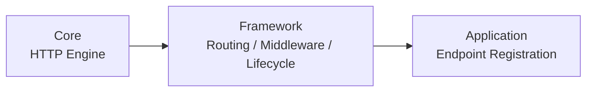
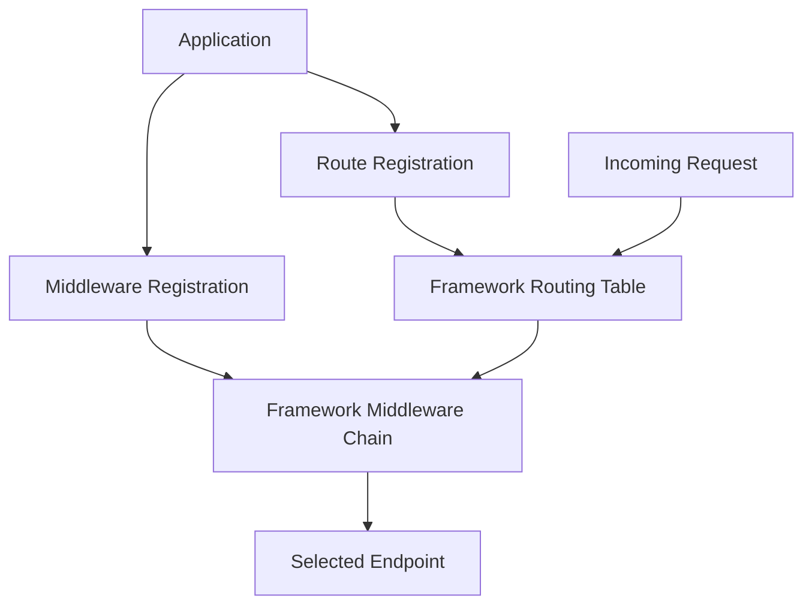
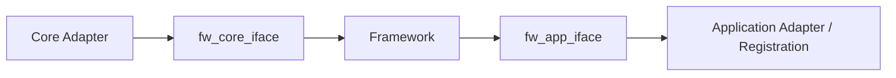
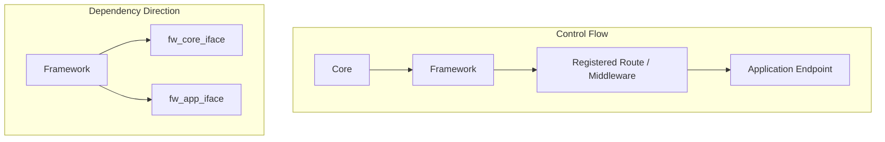

# Framework Perspective

## 문서 목적

이 문서는 Relion의 Framework가 어떤 REST API 기능을 제공하고, Core와 Application 사이에서 어떤 경계와 인터페이스를 통해 그 기능을 유지하는지를 설명합니다.

Relion 전체 구조와 프로젝트 제약은 [Project Perspective](./Project-Perspective.md) 문서에서 다루고, 여기서는 Framework 자체의 책임과 동작 방식에 집중합니다.

## Framework의 역할

Relion의 Framework는 Core와 Application 사이를 연결하는 중간 계층이지만, 단순히 요청을 전달하는 어댑터 계층은 아닙니다.  
이 계층은 실제로 REST API 서버가 동작하는 데 필요한 공통 기능을 제공합니다.

Framework가 맡는 핵심 역할은 다음과 같습니다.

- 라우팅 등록 및 라우팅 테이블 관리
- 미들웨어 등록 및 실행 순서 관리
- Request → Application 입력 변환
- Application 결과 → Response 변환
- 요청 처리 라이프사이클 제어
- Core와 Application 사이 경계 유지

즉, Application은 엔드포인트와 정책을 등록하지만, 그 등록 정보를 기준으로 실제 요청 흐름을 조직하고 실행하는 주체는 Framework입니다.

## Framework의 위치

Core는 HTTP 요청을 받아들이는 외부 엔진이고, Application은 실제 정책과 엔드포인트를 정의하는 영역입니다.
Framework는 이 둘 사이에서 요청 흐름을 제어하고, 등록된 라우팅과 미들웨어를 기준으로 REST API 동작을 구성합니다.

## Framework가 제공하는 기능

### 1. Routing

Application은 어떤 경로와 메서드가 어떤 엔드포인트에 연결되는지를 등록합니다.
하지만 라우팅 테이블을 보관하고, 요청 시 어떤 엔드포인트를 선택할지 결정하는 책임은 Framework에 있습니다.

즉,

* Application: 라우트 등록
* Framework: 라우팅 테이블 관리 및 매칭 수행

### 2. Middleware

Application은 인증, 로깅, 전처리 같은 미들웨어를 등록할 수 있습니다.
하지만 어떤 순서로 실행하고, 어느 시점에 다음 단계로 넘길지 결정하는 것은 Framework의 책임입니다.

즉,

* Application: 미들웨어 정의 및 등록
* Framework: 실행 체인 구성과 흐름 제어

### 3. Request / Response 변환

Core가 다루는 HTTP 세부사항을 Application까지 직접 올리지 않기 위해, Framework는 요청을 Application이 다룰 수 있는 형태로 변환하고, 반대로 Application의 결과를 HTTP 응답으로 변환합니다.

### 4. Lifecycle 제어

요청이 들어왔을 때 어떤 순서로 처리할지, 예외가 발생했을 때 어떤 흐름으로 종료할지, 미들웨어와 엔드포인트 호출을 어떻게 연결할지는 Framework가 관리합니다.

## 등록과 실행의 분리

Relion Framework의 중요한 특징 중 하나는 등록 주체와 실행 주체를 분리했다는 점입니다.

Application은 라우트와 미들웨어를 등록합니다.
하지만 그 정보는 Framework 내부의 테이블과 실행 체인으로 관리됩니다.
실제 요청이 들어왔을 때 어떤 엔드포인트를 선택하고 어떤 순서로 미들웨어를 통과시킬지는 Framework가 결정합니다.

이 구조 덕분에 Application은 정책과 엔드포인트 정의에 집중하고, Framework는 공통 요청 처리 규칙을 일관되게 유지할 수 있었습니다.

## 전체 연결 구조

Relion에서는 Framework를 양쪽 변화로부터 보호하기 위해 두 개의 인터페이스를 중심으로 경계를 만들었습니다.

* `fw_core_iface`: Core와 Framework 사이 경계
* `fw_app_iface`: Framework와 Application 사이 경계

이 구조의 목적은 Framework가 특정 HTTP 엔진 구현이나 특정 Application 내부 구조에 직접 종속되지 않게 만드는 것입니다.

## Core와의 경계

Core는 실제 HTTP 엔진을 포함하는 외부 영역입니다.
Framework가 Core의 구체 구현을 직접 알게 되면, 엔진 교체 시 라우팅, 미들웨어, 라이프사이클 로직까지 수정 범위가 커질 수 있습니다.

그래서 Core 쪽에서는 다음 원칙을 유지했습니다.

* HTTP 엔진 세부사항은 Core Adapter에서 처리
* Framework는 필요한 최소 인터페이스만 사용
* 엔진 교체 시 수정은 Core Adapter 중심으로 제한

## Application과의 경계

Application은 엔드포인트와 정책을 정의하고 등록하는 영역입니다.
하지만 Framework가 Application의 구체 계층 구조를 직접 알게 되면, 엔드포인트 구성 변화나 유스케이스 구조 변화가 Framework 수정으로 이어질 수 있습니다.

그래서 Application 쪽에서는 다음 원칙을 유지했습니다.

* Application은 엔드포인트와 미들웨어를 등록
* Framework는 등록된 내용을 기준으로 요청 흐름을 운영
* Framework는 비즈니스 의미를 해석하지 않음
* Application 내부 구조는 `fw_app_iface` 바깥에 둠

## 왜 양방향 DIP가 필요했는가

Relion에서 중요한 것은 Framework가 실제 기능을 제공하면서도, Core와 Application 양쪽 구현 세부사항에 직접 묶이지 않는 상태를 만드는 것이었습니다.

한쪽만 추상화하면 다른 한쪽 변화가 라우팅, 미들웨어, 변환, 라이프사이클 같은 Framework 책임으로 그대로 번질 수 있습니다.
그래서 양쪽 모두에 대해 DIP를 적용해 Framework를 가운데서 보호하는 방식이 필요했습니다.

정리하면 다음과 같습니다.

* Core 변화는 `fw_core_iface` 바깥에서 흡수
* Application 변화는 `fw_app_iface` 바깥에서 흡수
* Framework는 라우팅, 미들웨어, 변환, 라이프사이클에 집중

## 제어 흐름과 의존 방향

이 구조에서 중요한 점은 실행 흐름과 의존 방향이 다르다는 것입니다.

* 실행 흐름은 Core → Framework → 등록된 엔드포인트로 이동합니다.
* 하지만 Framework는 구체 구현이 아니라 인터페이스에 의존합니다.

이 차이 덕분에 Framework는 서버 동작 규칙을 직접 제공하면서도, 양쪽 구현 세부사항에는 끌려가지 않는 구조를 유지할 수 있었습니다.

## 결과

이 구조를 통해 다음 효과를 얻을 수 있었습니다.

* 라우팅과 미들웨어 처리 규칙을 Framework에 일관되게 고정
* HTTP 엔진 교체 시 Framework 수정 범위 최소화
* Application 내부 변경이 Framework 수정으로 번지지 않음
* Core와 Application 사이 연결 규칙을 유지한 채 엔드포인트 확장 가능

정리하면 Relion Framework의 핵심은 단순 연결 계층이 아니라, REST API 동작 규칙을 제공하는 계층이면서도 양쪽 구현 변화로부터 보호되는 계층이라는 점에 있습니다.

## 요약

Relion Framework는 다음 기준으로 설계했습니다.

* 라우팅과 미들웨어를 Framework 기능으로 제공
* 등록 주체는 Application, 실행과 관리 주체는 Framework
* Core와의 경계는 `fw_core_iface`로 분리
* Application과의 경계는 `fw_app_iface`로 분리
* 제어 흐름과 의존 방향을 분리해 양쪽 구현 변화로부터 보호

프로젝트 전체 구조와 제약은 [Project Perspective](./Project-Perspective.md) 문서에서 설명합니다.