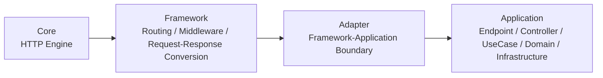
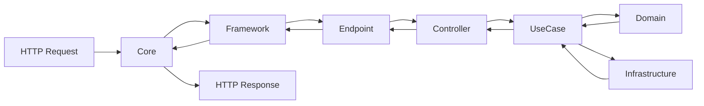
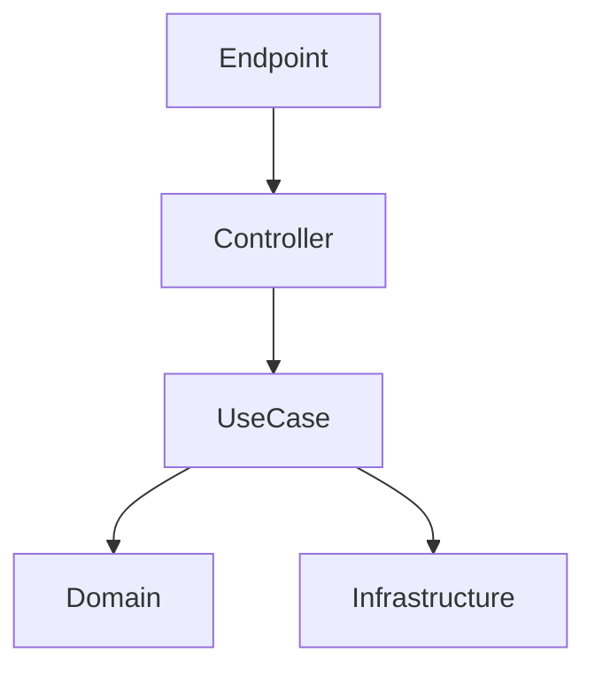

# Project Perspective

## 프로젝트 개요

Relion은 여러 종류의 임베디드 장비와 리눅스 기반 환경에 포팅 가능한 REST API 서버입니다.  
이 프로젝트의 핵심은 REST API 기능을 구현하는 것 자체보다, 실행 환경과 HTTP 엔진이 바뀌더라도 수정 범위가 전체 시스템으로 번지지 않도록 기준을 세우는 일이었습니다.

일반적인 서비스 환경에서는 프레임워크와 라이브러리를 조합해 기능을 빠르게 붙일 수 있지만, Relion이 놓인 환경에서는 먼저 고려해야 할 제약이 달랐습니다.  
라이센스, HTTP 엔진 선택, 장비별 실행 환경 차이, 시스템 자원, 유지보수 범위 같은 조건이 설계를 먼저 결정했고, 이 제약을 무시하면 기능이 늘어날수록 포팅과 유지보수 비용이 함께 커질 수 있었습니다.

그래서 Relion은 특정 HTTP 엔진에 맞춘 서버가 아니라, 실행 환경 차이와 외부 엔진 변화가 어플리케이션 전체 수정으로 번지지 않도록 구조를 분리하는 방향으로 설계했습니다.

## 어떤 문제가 있었는가

이 프로젝트에서 중요했던 문제는 크게 네 가지였습니다.

- HTTP 엔진이 바뀔 수 있었습니다.
- 실행 환경과 장비 구성이 달라질 수 있었습니다.
- 장비별 차이가 비즈니스 로직까지 직접 들어오면 안 됐습니다.
- 계층 규칙이 문서에만 남고 실제 코드에서 무너지면 안 됐습니다.

즉, 이 프로젝트는 단순히 REST API를 제공하는 서버를 만드는 일이 아니라, 변경 가능성이 큰 지점을 먼저 격리하고 그 영향이 다른 계층으로 퍼지지 않게 막는 일이 핵심이었습니다.

## 전체 구조

Relion은 Core, Framework, Application의 3계층으로 나누어 구성했습니다.

* Core는 HTTP 엔진 자체를 담당합니다.
* Framework는 요청 처리 흐름, 라우팅, 미들웨어, 요청/응답 변환을 담당합니다.
* Application은 실제 비즈니스 로직과 외부 시스템 연동을 담당합니다.

여기서 중요한 것은 기능 분리가 아니라 영향 분리였습니다.
HTTP 엔진 변화는 Core 경계에서 멈추고, 요청 처리 규칙 변화는 Framework 경계에서 멈추고, 장비별 외부 시스템 차이는 Application 내부의 Infrastructure에서 멈추도록 정리하는 것이 목표였습니다.

## 요청 처리 흐름

요청은 Core를 통해 들어오지만, 실제 흐름 제어와 변환은 Framework가 맡고, 어플리케이션 로직은 Application 계층 안에서만 처리되도록 구성했습니다.

이 흐름에서 중요하게 본 기준은 다음과 같습니다.

* HTTP 세부사항이 UseCase나 Domain까지 직접 들어오지 않을 것
* 외부 시스템 연동이 Domain 판단을 오염시키지 않을 것
* 요청 처리 흐름과 비즈니스 규칙을 분리할 것
* 변경 시 어느 계층을 수정해야 하는지가 바로 보일 것

## Application 관점의 구조

Relion의 Application은 단순히 엔드포인트 함수 몇 개를 두는 방식이 아니라, 책임에 따라 계층을 분리하는 방향으로 설계했습니다.

각 계층의 역할은 아래와 같습니다.

| 계층             | 역할                     |
| -------------- | ---------------------- |
| Endpoint       | Framework와 연결되는 진입점    |
| Controller     | 요청 해석과 어플리케이션 흐름 연결    |
| UseCase        | 정책과 흐름 제어              |
| Domain         | 비즈니스 규칙과 의미            |
| Infrastructure | 외부 시스템, 입출력, 장비 의존성 처리 |

이 구조의 목적은 계층을 멋있게 나누는 것이 아니라, 수정이 들어왔을 때 영향 범위를 계층 안에 가두는 것이었습니다.
예를 들어 외부 장비 연동 방식이 바뀌면 Infrastructure를 중심으로 대응하고, 정책이 바뀌면 UseCase를 중심으로 대응하고, 비즈니스 의미가 바뀌면 Domain을 중심으로 대응할 수 있어야 했습니다.

## 제약이 구조를 결정한 방식

Relion의 구조는 이론에서 출발한 것이 아니라 제약에서 출발했습니다.

### 1. HTTP 엔진 교체 가능성

특정 엔진에 맞춰 전체 흐름을 설계하면, 교체 시 Framework와 어플리케이션까지 수정이 번질 수 있습니다.
이를 막기 위해 Core를 외부 엔진 경계로 두고, Framework는 Core의 세부 구현에 직접 끌려가지 않도록 분리했습니다.

### 2. 실행 환경 차이

장비와 환경이 달라지면 입출력 방식, 시스템 제약, 외부 연동 조건이 달라질 수 있습니다.
이 차이가 상위 계층까지 직접 들어오지 않도록, 어플리케이션 내부에서는 Infrastructure를 통해 외부 시스템 의존성을 격리했습니다.

### 3. 유지보수 범위 통제

프로젝트가 커질수록 가장 큰 문제는 기능 추가보다 수정 범위 예측이 어려워지는 점이었습니다.
그래서 처음부터 “무엇을 어디에 둘 것인가”보다 “어떤 변경이 어디까지 번질 수 있는가”를 기준으로 책임을 나누었습니다.

### 4. 규칙의 강제 필요

계층 구조는 문서로만 남기면 시간이 지나면서 쉽게 무너질 수 있습니다.
그래서 Relion에서는 layer-check를 통해 의존성 위반을 빌드 단계에서 검출하도록 했습니다.

## layer-check

Relion에서는 계층 구조를 설명만 하지 않고, 빌드 과정에서 검증할 수 있도록 layer-check를 구성했습니다.

핵심 목적은 다음과 같았습니다.

* Endpoint가 Domain을 직접 호출하지 않게 할 것
* Infrastructure가 상위 정책 계층을 오염시키지 않게 할 것
* 외부 포맷과 구현 세부사항이 안쪽 계층으로 직접 침투하지 않게 할 것
* 문서에 적힌 의존 방향이 실제 코드에서도 유지되게 할 것

이 장치는 단순한 정리 규칙이 아니라, 구조가 시간이 지나면서 무너지는 것을 막는 안전장치 역할을 했습니다.

## 결과

Relion은 다음과 같은 결과로 이어졌습니다.

* HTTP 엔진 교체를 어플리케이션 수정 없이 검증
* 엔드포인트 20개 이상 확장
* 계층 위반을 빌드 단계에서 자동 검출
* 실행 환경 차이와 외부 시스템 차이가 상위 로직 전체 수정으로 번지지 않도록 유지

정리하면 Relion의 핵심 성과는 REST API 서버를 구현한 것 자체보다, 변경이 들어왔을 때 수정 지점이 분명하고 영향 범위가 계층 밖으로 쉽게 퍼지지 않도록 시스템을 정리한 데 있었습니다.

## 제 역할

이 프로젝트에서는 요구사항 분석부터 아키텍처 설계, Framework 구현, Adapter 경계 설계, 어플리케이션 계층 구성, layer-check 구축, 이식성 검증까지 전체 흐름을 단독으로 진행했습니다.

중요하게 본 것은 기능 수를 늘리는 것보다, HTTP 엔진 변화, 실행 환경 차이, 외부 시스템 의존성이 전체 시스템 수정으로 번지지 않도록 기준을 세우는 일이었습니다.

## 다음 문서

이 문서는 Relion을 시스템 전체 관점에서 정리한 문서입니다.
Framework 자체가 Core와 Application 사이에서 어떻게 보호되었는지, 어떤 인터페이스와 Adapter 경계로 연결했는지는 [Framework Perspective](./Framework-Perspective.md) 문서에서 설명합니다.
