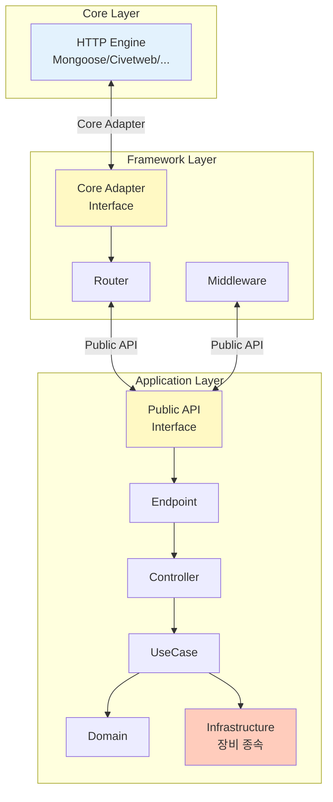
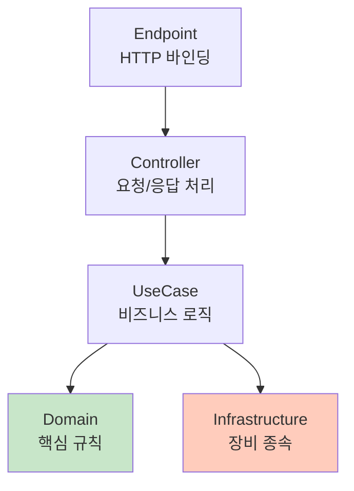
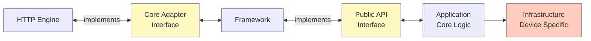

# Relion

> 여러 종류의 AP 장비에 즉시 이식 가능한 REST API 서버

**Core-Framework-Application 3계층 구조로 HTTP 엔진 교체 1일, 장비 환경 변경 시 Infrastructure만 수정**

---

## 목차

1. [Executive Summary](#1-executive-summary)
2. [개발 배경](#2-개발-배경)
   - [요구사항 및 제약사항](#21-요구사항-및-제약사항)
   - [설계 결정](#22-설계-결정)
3. [3계층 구조 개요](#3-3계층-구조-개요)
   - [전체 구조](#31-전체-구조)
   - [Core Layer](#32-core-layer)
   - [Framework Layer](#33-framework-layer)
   - [Application Layer](#34-application-layer)
   - [계층 간 관계](#35-계층-간-관계)
4. [이식성 검증 결과](#4-이식성-검증-결과)
   - [HTTP 엔진 교체 (Mongoose → Civetweb)](#41-http-엔진-교체-mongoose--civetweb)
   - [Application 확장](#42-application-확장)
   - [빌드 타임 규율 검증](#43-빌드-타임-규율-검증)
5. [기술 스택 및 개발 현황](#5-기술-스택-및-개발-현황)
   - [기술 스택](#51-기술-스택)
   - [개발 현황](#52-개발-현황)
   - [완성된 주요 기능](#53-완성된-주요-기능)
6. [역할 및 환경](#6-역할-및-환경)
7. [문서 안내](#7-문서-안내)
8. [핵심 성과 요약](#8-핵심-성과-요약)

---

## 1. Executive Summary

Relion은 **여러 종류의 AP 장비에 즉시 이식 가능한 REST API 서버**를 목표로,  
C 환경에서 Core–Framework–Application 3계층 구조를 직접 설계하고 구현한 프로젝트입니다.  

Relion의 핵심은 **HTTP 엔진(Core)** 및 **장비 환경(Infrastructure)** 변경이 발생해도  
**Framework와 Application의 비즈니스 로직은 단 한 줄도 수정되지 않는 구조적 독립성**을 제공한다는 점입니다.

이를 위해:
- Core 교체는 Core Adapter 구현만 다시 작성하면 되고  
- 장비 종속 요소는 Infrastructure 계층에만 존재하며  
- Application의 핵심 비즈니스 로직은 Clean Architecture로 완전히 보호됩니다.  

Relion은 C 기반 환경에서 “아키텍처 규율”을 빌드 시스템(layer-check)로 강제하여  
**설계의 이론적 구조가 실제 구현에서도 100% 유지되도록 한 점**이 가장 큰 특징입니다.

**핵심 달성 사항**
- HTTP 엔진 교체(Mongoose → Civetweb) 1일, Application 영향 0  
- Framework ↔ Application 간 완전 분리 (Public API + Adapter)  
- 장비 변경 시 Infrastructure만 교체, Domain/UseCase 100% 재사용  
- 빌드 타임 강제 규율(layer-check)로 계층 위반 자동 검출  

Relion은 단순한 서버 구현이 아니라,  
**어떤 환경에서도 재사용 가능한 구조적 API 서버를 C로 완전히 구현한 사례**입니다.

---

## Relion이 가진 난이도

Relion 프로젝트가 갖는 기술적 난이도를 한 문단으로 요약하면 다음과 같습니다:

- AP 장비는 제조사·펌웨어마다 환경이 달라, 하나의 코드베이스를 그대로 배포하기 어렵다  
- HTTP 엔진은 GPL, MIT, 보안 취약점 등 여러 제약이 있어 교체 가능성이 항상 존재한다  
- C 환경에서 Clean Architecture + Hexagonal을 동시에 적용하는 일은 구조적·운영적 난이도가 높다  
- "Core–Framework–Application 독립성"을 실제로 보장하려면 빌드 타임 규율이 필수다  
- 프레임워크/어플리케이션의 경계·계약을 설계한 사람과 구현한 사람이 동일해야 구조가 유지된다  

이 조건들을 충족시키기 위해, Relion은 **프레임워크부터 어플리케이션까지 전 계층을 단독 설계·구현**했습니다.


---

## 역할

Relion에서의 역할은 단순 개발이 아니라, **전체 구조의 설계 및 구현**입니다.

- 요구사항 분석 → 제약사항 도출 → 이식성 전략 수립  
- Core–Framework–Application 3계층 아키텍처 설계  
- Clean Architecture 기반 Application 5계층 설계  
- Core Adapter, Public API, Response Adapter 등 DIP 경계 직접 설계  
- Framework 핵심 기능(라우팅, 미들웨어, 에러, JSON, 로깅) 직접 구현  
- layer-check 빌드 시스템 설계 및 구현  
- HTTP 엔진 교체 검증(Mongoose ↔ Civetweb) 1일 내 수행  
- Application 엔드포인트 20개 이상 확장  
- 운영 안정화(메모리, 동시성, 복구 경로) 진행  

즉, "설계 의도 → 구조 → 규율 → 구현" 전 과정을 **완전한 일관성** 속에서 수행했습니다.


---

## Relion의 결과물 요약

- **이식성**: HTTP 엔진 교체 1일, Application 영향 0  
- **독립성**: Framework ↔ Application 간 컴파일 레벨 분리  
- **재사용성**: 장비 환경 변경 시 Infrastructure만 교체  
- **규율 강제**: 계층 위반은 자동 검출(layer-check)로 불가능  

---

## 2. 개발 배경

### 2.1 요구사항 및 제약사항

```
요구사항: REST API 서버 필요
제약사항: 어떤 AP 장비든 금방 이식 가능해야 함
```

AP 장비는 제조사, 모델, 펌웨어 버전에 따라 HTTP 엔진, 파일 시스템, 네트워크 스택이 다릅니다. 동일한 비즈니스 로직을 여러 장비에 배포하려면, 장비 종속적인 부분과 독립적인 부분을 명확히 분리해야 했습니다.

### 2.2 설계 결정

**이식성 전략 1: Core-Framework 분리**

HTTP 엔진은 보안 취약점, 성능 이슈, 라이센스 문제 등으로 교체가 필요할 수 있습니다. 초기 개발 시 Mongoose를 사용했으나, GPL 라이센스 문제로 Civetweb(MIT)으로 전환했습니다. 향후에도 보안 위험 발견 시 다른 엔진으로 전환하거나, 특수 요구사항이 있을 경우 커스텀 엔진을 구현할 수도 있습니다.

- HTTP 엔진 교체 시: Adapter만 수정
- Framework 재빌드: 필요 (Adapter 포함)
- Application 재빌드: 불필요 (완전 독립)
- Framework는 "어떤 HTTP 엔진인지" 알 필요 없음

**이식성 전략 2: Application Clean Architecture**

장비별 차이는 파일 시스템 경로, 네트워크 인터페이스 이름, 설정 파일 포맷 등 Infrastructure 계층에 집중됩니다.

- 장비별 차이: Infrastructure만 수정
- Domain/UseCase/Controller: 완전 재사용
- 비즈니스 규칙은 장비와 무관

**결과:**

```
HTTP 엔진 변경 → Adapter 수정, Framework 재빌드, Application 영향 0
장비 환경 변경 → Infrastructure만 재빌드
핵심 비즈니스 로직 → 완전 보존
```

이 구조 덕분에:
- HTTP 엔진 교체: Adapter 수정으로 1일 내 전환 가능
- 새로운 AP 장비 배포: Infrastructure 구현만으로 가능
- 커스텀 HTTP 엔진 적용: Adapter 인터페이스 구현으로 가능
- 비즈니스 로직 변경: 장비와 무관하게 Domain/UseCase만 수정

---

## 3. 3계층 구조 개요

### 3.1 전체 구조



### 3.2 Core Layer

**역할**: HTTP 프로토콜 처리

**특징:**
- Relion은 Core를 직접 구현하지 않음
- 초기 개발: Mongoose 사용 (빠른 프로토타이핑)
- 배포 전환: Civetweb 사용 (GPL → MIT 라이센스 전환)
- 보안 취약점 발견 시 다른 엔진으로 전환 가능
- 특수 요구사항 발생 시 커스텀 엔진 구현 가능

**교체 가능성:**
- 개발 단계: Mongoose 사용 (GPL, 빠른 개발)
- 배포 단계: Civetweb 전환 (MIT, 상용 라이센스 호환)
- 보안 이슈: 다른 HTTP 엔진으로 전환
- 특수 요구: 커스텀 HTTP 엔진 구현

**격리 방법**: Core Adapter 인터페이스

Framework가 Core에 등록하는 콜백:

```c
typedef struct fw_core_callbacks_t {
    int (*on_request)(const fw_request_t *request, 
                      fw_response_t **response, 
                      void *user_context);
    void (*on_close)(int connection_id);
    void *user_context;
} fw_core_callbacks_t;

fw_error_t fw_core_register_callbacks(const fw_core_callbacks_t *callbacks);
```

Core가 응답을 전송하는 인터페이스:

```c
fw_error_t fw_core_send_response(const fw_response_t *response);
```

Framework는 이 인터페이스를 통해서만 Core와 통신합니다. `fw_core_send_response`는 Mongoose 구현체와 Civetweb 구현체가 각각 다르게 구현하지만, 인터페이스는 동일합니다. 따라서 Adapter 구현체가 바뀌어도 Framework 코드는 수정이 불필요합니다.

### 3.3 Framework Layer

**역할**: 웹 프레임워크 기능 제공 (Express.js 스타일)

**주요 컴포넌트:**
- Router: 경로 매칭 및 라우팅
- Middleware: Chain of Responsibility 패턴
- Logger: PID/TID/Time/Level 포함 로깅
- Error Handler: 에러 코드 매핑 및 응답 구성

**특징:**
- Core와 Application 모두로부터 독립
- 하위(Core)는 Core Adapter로 격리
- 상위(Application)는 Public API로 격리

**완성된 기능:**
```
Routing System (경로 파라미터 지원)
Middleware Chain (인증, 로깅, 에러 처리)
Request/Response Abstraction
Logger (구조화된 로그)
Error Handler (일관된 에러 응답)
JSON Parser Integration
```

### 3.4 Application Layer

**역할**: AP 관리 비즈니스 로직

**아키텍처:**
- 소프트웨어 아키텍처: Clean Architecture (5계층)
- 시스템 아키텍처: Hexagonal Architecture (Port-Adapter 패턴)

**구조**: Clean Architecture 5계층



**계층별 책임:**

| 계층 | 책임 | 장비 독립성 |
|------|------|----------|
| Endpoint | 라우팅 등록 | 독립 |
| Controller | HTTP 요청/응답 처리 | 독립 |
| UseCase | 비즈니스 로직 조합 | 독립 |
| Domain | 핵심 규칙 | 독립 |
| Infrastructure | 파일/네트워크/설정 | 장비 종속 |

**격리 방법:**
- Infrastructure만 장비 종속적
- Endpoint/Controller/UseCase/Domain은 Framework와 독립
- Framework 접근: Adapter 구현으로 Framework 기능 사용
- Application은 Framework를 알지만, Adapter를 통해 이식성 확보

### 3.5 계층 간 관계



**인터페이스 역할:**
- Core Adapter: HTTP 엔진 교체 시 Framework 핵심 로직 보호
- Public API: Framework 변경 시 Application 보호
- Adapter (Router, Middleware 등): Application이 Framework 기능 사용
- Infrastructure: 장비 변경 시 Core Logic 보호

---

## 4. 이식성 검증 결과

### 4.1 HTTP 엔진 교체 (Mongoose → Civetweb)

**배경:**
- 초기 개발: Mongoose 사용 (빠른 프로토타이핑)
- 배포 단계: GPL 라이센스 문제 발견
- 해결: MIT 라이센스 Civetweb으로 전환 필요

**전환 과정:**

| 영역 | 변경 범위 | 소요 시간 |
|------|----------|----------|
| Core Adapter 구현체 | 약 200 라인 | 1일 |
| Framework | 재빌드 필요 (코드 수정 0) | - |
| Application | 영향 없음 | - |
| 테스트 | 기존 테스트 100% 재사용 | - |

**Core Adapter 인터페이스:**

Framework가 Core에 등록하는 콜백 구조:

```c
typedef struct fw_core_callbacks_t {
    int (*on_request)(const fw_request_t *request, 
                      fw_response_t **response, 
                      void *user_context);
    void (*on_close)(int connection_id);
    void *user_context;
} fw_core_callbacks_t;

fw_error_t fw_core_register_callbacks(const fw_core_callbacks_t *callbacks);
```

**Adapter 구현 차이:**

Mongoose와 Civetweb은 HTTP 요청 처리 방식이 다르지만, Adapter가 이 차이를 흡수합니다.

```c
// Mongoose Adapter 구현
fw_error_t fw_core_send_response_mongoose(const fw_response_t *response) {
    struct mg_connection *conn = get_current_connection();
    mg_send_http_chunk(conn, response->body, response->body_length);
    return FW_SUCCESS;
}

// Civetweb Adapter 구현
fw_error_t fw_core_send_response_civetweb(const fw_response_t *response) {
    struct mg_connection *conn = get_current_connection();
    mg_printf(conn, "HTTP/1.1 %d OK\r\n", response->status_code);
    mg_printf(conn, "Content-Length: %zu\r\n\r\n", response->body_length);
    mg_write(conn, response->body, response->body_length);
    return FW_SUCCESS;
}
```

인터페이스(`fw_core_send_response`)는 동일하지만, 구현체(Mongoose/Civetweb)가 다릅니다.

**검증 결과:**
- Framework는 `fw_core_callbacks_t` 인터페이스와 `fw_core_send_response` 시그니처만 의존
- HTTP 엔진이 Mongoose에서 Civetweb으로 바뀌어도 Framework 코드는 수정 불필요
- Framework는 Adapter 포함으로 재빌드되지만, 로직 변경 없음
- Application은 Public API만 의존하므로 완전히 독립적
- 기존 단위 테스트, 통합 테스트 모두 수정 없이 통과

### 4.2 Application 확장

**확장 내역:**
- Endpoint 20개 추가 (시스템 설정, 상태 모니터링, 사용자 관리)
- 개발 기간: 3주
- Framework 코드 수정: 0회

**확장 과정:**

Application은 Adapter를 구현하여 Framework 기능을 사용합니다. Framework가 변경되더라도 Adapter만 수정하면 되므로, UseCase/Domain/Endpoint는 영향받지 않습니다.

```c
// Adapter 구현 (application/adapters/router_adapter.c)
typedef struct {
    void (*register_route)(const char* method, 
                          const char* path, 
                          route_handler_t handler);
} router_adapter_t;

// Framework 라우팅 시스템 연결
void init_router_adapter(router_adapter_t* adapter) {
    adapter->register_route = fw_register_route; // Framework API 사용
}

// Endpoint에서 사용 (application/endpoints/system_endpoint.c)
void register_system_endpoints(router_adapter_t* adapter) {
    adapter->register_route("GET", "/api/system/status", handle_system_status);
    adapter->register_route("POST", "/api/system/config", handle_system_config);
    adapter->register_route("GET", "/api/system/logs", handle_system_logs);
    // ... 17개 더
}
```

**검증 결과:**
- Framework 변경 시: Adapter만 수정
- UseCase/Domain/Endpoint: Framework와 완전 독립
- Public API가 안정적이므로 Application 핵심 로직은 독립적으로 개발 가능
- Infrastructure 계층만 장비별로 구현하면 즉시 배포 가능

### 4.3 빌드 타임 규율 검증

**Layer-check 시스템:**

Relion은 계층 위반을 런타임이 아닌 빌드 타임에 자동으로 검출합니다.

**검증 규칙:**

```bash
$ make layer-check
Checking layer dependencies...
Controllers do not access Infrastructure
Domain has no upward dependencies
Application uses only Public API
Framework internal is isolated
All layer rules verified.
```

**실제 검증 사례:**

**Case 1: Controller → Infrastructure 직접 접근**
```c
// controllers/system_controller.c
#include "infrastructure/system_repository.h"  // 금지!

$ make
Error: controllers cannot include infrastructure directly
Use UseCases to access infrastructure.
Build failed.
```

**Case 2: Domain → 상위 계층 참조**
```c
// domain/system_config.c
#include "usecases/update_config.h"  // 금지!

$ make
Error: Domain cannot depend on upper layers
Undefined reference to 'update_config'
Build failed.
```

**Case 3: Framework 내부 직접 접근**
```c
// application/controllers/api_controller.c
#include "framework/internal/router_impl.h"  // 금지!

$ make
Error: framework/internal/router_impl.h: No such file or directory
Only include/fw_*.h headers are accessible.
Build failed.
```

**효과:**
- 신입 개발자도 아키텍처 위반 불가능
- 문서를 읽지 않아도 빌드 시스템이 규율 강제
- 계층 위반은 배포 전 자동 차단

---

## 5. 기술 스택 및 개발 현황

### 5.1 기술 스택

| 영역 | 기술 | 선택 이유 |
|------|------|----------|
| 언어 | C | AP 장비 임베디드 환경 |
| HTTP 엔진 | Civetweb (MIT) | 상용 라이센스 호환 |
| JSON | JSON-C | 경량, 임베디드 최적화 |
| 빌드 | Makefile + Layer-check | 계층 위반 자동 검증 |
| 테스트 | Valgrind + Custom Scripts | 메모리 안정성 검증 |

### 5.2 개발 현황

| 영역 | 상태 | 설명 |
|------|------|------|
| **아키텍처 설계** | 완료 | Core-Framework-Application 분리, DIP, Layer-check |
| **Core 격리** | 완료 | Core Adapter, HTTP 엔진 교체 검증 완료 |
| **Framework 핵심** | 완료 | Routing, Middleware, Logger, Error Handler, JSON |
| **Application 구조** | 완료 | Clean Architecture 5계층, DIP 기반 의존성 관리 |
| **Application API** | 구현 중 | AP 관리 엔드포인트 (시스템 설정, 모니터링, 사용자) |
| **보안 정책** | 구현 중 | HTTPS 인증서, 세션 인증, 권한 제어 |
| **운영 안정화** | 진행 중 | 메모리 관리, 동시성 처리, 에러 복구 |
| **배포 준비** | 2025 Q4 | 통합 테스트, 성능 검증, 문서화 |

### 5.3 완성된 주요 기능

**Framework:**
```
Express.js 스타일 Routing (경로 파라미터 지원)
Middleware Chain (인증, 로깅, CORS, 에러 처리)
Request/Response Abstraction
구조화된 Logger (PID/TID/Time/Level)
Error Handler (코드 매핑, 일관된 응답)
JSON Parser Integration
```

**Application:**
```
Clean Architecture 5계층 구조
DIP 기반 계층 간 의존성 관리
Response Adapter (타입 격리)
독립 테스트 가능 구조
```

**빌드 시스템:**
```
Layer-check (계층 위반 자동 검증)
계층별 독립 빌드 (Core/Framework/Application)
컴파일 타임 규율 강제
```

---

## 6. 역할 및 환경

**역할**: 전체 아키텍처 설계 및 구현 주도

**기간**: 2025년 10월 ~ 현재 (진행 중)

**언어/기술**: C, Civetweb (MIT License), JSON-C

**목표**: AP 장비 이식 가능한 REST API 서버로 2025년 4분기 배포

**개발 과정:**
- 요구사항 분석 및 제약사항 도출
- 이식성 확보를 위한 계층 분리 전략 수립
- Core-Framework-Application 3계층 아키텍처 설계
- Clean Architecture 기반 Application 내부 구조 설계
- Layer-check 빌드 시스템 구현
- Framework 핵심 기능 구현 (Routing, Middleware, Logger, Error)
- HTTP 엔진 교체 검증 (Mongoose → Civetweb)
- Application API 엔드포인트 구현 (진행 중)
- 보안 정책 및 운영 안정화 (진행 중)

---

## 7. 문서 안내

Relion은 세 가지 관점에서 문서화되어 있습니다.

### 7.1 프레임워크 관점

**목적**: Framework의 DIP 설계 상세 분석

**주요 내용:**
- Core Adapter Interface: Framework와 HTTP 엔진 격리
- Public API Interface: Application과 Framework 격리
- Adapter (Router, Middleware 등): Application의 Framework 기능 사용
- Response Adapter: 타입 변환 전략
- DIP가 가져온 실제 이득

**문서**: [`relion-framework-perspective.md`](./relion-framework-perspective.md)

### 7.2 프로젝트 관점

**목적**: 시스템 전체 협력 구조 및 실무 적용

**주요 내용:**
- 전체 요청 흐름 (HTTP → Core → Framework → Application)
- Application 내부 Clean Architecture 구조
- Hexagonal Architecture 적용 (Port-Adapter 패턴)
- Layer-check 빌드 시스템
- 실무 이식 사례 (HTTP 엔진 전환, 장비 환경 대응)

**문서**: [`relion-project-perspective.md`](./relion-project-perspective.md)

### 7.3 읽는 순서

1. **전체 파악**: 현재 문서 (Overview) 먼저 읽기
2. **설계 이해**: 프레임워크 관점 → DIP와 인터페이스 설계
3. **실무 적용**: 프로젝트 관점 → 시스템 통합 및 배포 경험

---

## 8. 핵심 성과 요약

**이식성 확보:**
```
HTTP 엔진 교체: 1일 (Adapter만 수정, Framework 재빌드)
장비 환경 변경: Infrastructure만 수정
핵심 로직: 100% 재사용
```

**독립적 진화:**
```
Framework 확장: Application 수정 불필요
Application 확장: Framework 코드 수정 불필요 (Adapter 사용)
HTTP 엔진 교체: Application 영향 0
```

**빌드 타임 강제:**
```
계층 위반 시도: 100% 자동 검출
Controller → Infra: 컴파일 에러
Domain → 상위: 링크 에러
Framework 내부: include 에러
```

**실무 검증:**
```
Civetweb ↔ Mongoose: 1일 전환 (Adapter만 수정)
Endpoint 20개 추가: Framework 코드 수정 0회
테스트 재사용: 100%
```

Relion은 "이식 가능한 REST API 서버"라는 요구사항을, 구조적 설계를 통해 실현한 프로젝트입니다.
