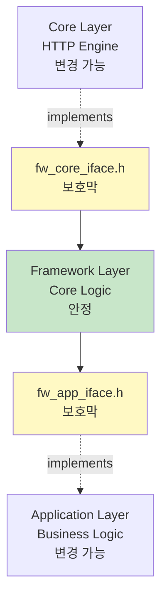

# Relion - 프레임워크 관점

> Framework의 DIP 설계와 구조적 독립성

---

## 목차

1. [설계 철학](#1-설계-철학)
   - [해결하려는 근본 문제](#11-해결하려는-근본-문제)
   - [양방향 DIP를 선택한 이유](#12-양방향-dip를-선택한-이유)
   - [인터페이스 기반 경계의 원칙](#13-인터페이스-기반-경계의-원칙)

2. [핵심 인터페이스와 경계](#2-핵심-인터페이스와-경계)
   - [인터페이스가 정의하는 정책](#21-인터페이스가-정의하는-정책)
   - [fw_core_iface.h: Core Adapter 경계](#22-fw_core_ifaceh-core-adapter-경계)
   - [fw_app_iface.h: Application 경계](#23-fw_app_ifaceh-application-경계)
   - [두 인터페이스가 만드는 보호막](#24-두-인터페이스가-만드는-보호막)

3. [DIP 양방향 구조](#3-dip-양방향-구조)
   - [Framework 중심의 양방향 격리](#31-framework-중심의-양방향-격리)
   - [의존성 흐름과 제어 흐름의 분리](#32-의존성-흐름과-제어-흐름의-분리)
   - [컴파일 타임 vs 런타임 의존성](#33-컴파일-타임-vs-런타임-의존성)

4. [Core Adapter 요약](#4-core-adapter-요약)
   - [책임과 역할](#41-책임과-역할)
   - [핵심 계약](#42-핵심-계약)
   - [교체 가능성 보장](#43-교체-가능성-보장)

5. [Application Interface 요약](#5-application-interface-요약)
   - [책임과 역할](#51-책임과-역할)
   - [핵심 계약](#52-핵심-계약)
   - [확장 가능성 보장](#53-확장-가능성-보장)

6. [타입 격리 전략](#6-타입-격리-전략)
   - [전방 선언으로 컴파일 타임 의존성 제거](#61-전방-선언으로-컴파일-타임-의존성-제거)
   - [계층 간 타입 변환](#62-계층-간-타입-변환)

7. [실제 이득 (정량화)](#7-실제-이득-정량화)
   - [HTTP 엔진 교체: 1일, 0라인](#71-http-엔진-교체-1일-0라인)
   - [Framework 확장: Application 영향 0](#72-framework-확장-application-영향-0)
   - [Application 확장: 1주, Framework 수정 0회](#73-application-확장-1주-framework-수정-0회)

8. [부록: 구현 예시](#8-부록-구현-예시)
   - [Core Adapter 구현 예시](#81-core-adapter-구현-예시)
   - [Application Interface 구현 예시](#82-application-interface-구현-예시)
   - [Adapter 패턴 적용 예시](#83-adapter-패턴-적용-예시)

---

## 1. 설계 철학

### 1.1 해결하려는 근본 문제

Relion이 직면한 본질적 문제는 다음과 같습니다:

**문제 1: HTTP 엔진의 불확실성**
- GPL 라이센스 문제로 Mongoose → Civetweb 전환 필요
- 보안 취약점 발견 시 즉시 다른 엔진으로 전환해야 함
- 특수 요구사항 발생 시 커스텀 엔진 구현 가능성

**문제 2: AP 장비 환경의 다양성**
- 제조사마다 파일 시스템, 네트워크 스택이 다름
- 동일한 비즈니스 로직을 여러 장비에 배포해야 함
- 장비별 차이가 핵심 로직을 오염시키면 안 됨

**문제 3: 계층 간 결합도**
- Framework가 Core에 직접 의존하면: Core 변경 시 Framework 전체 재작성
- Application이 Framework 내부에 의존하면: Framework 변경 시 Application 전체 영향
- 계층 간 경계가 없으면: 한 곳의 변경이 전체 시스템으로 전파

**핵심 인사이트:**

"변경은 항상 발생한다. 변경을 막을 수 없다면, 변경이 전파되지 않는 구조를 만들어야 한다."

### 1.2 양방향 DIP를 선택한 이유

일반적인 계층 구조는 상위 → 하위 방향으로만 의존성을 제어합니다. 그러나 Relion은 Framework를 중심으로 **양방향 모두** DIP를 적용했습니다.

**하위 격리 (Core Adapter):**
```
Framework가 Core에 의존하는 대신
→ Framework가 인터페이스를 정의하고
→ Core Adapter가 인터페이스를 구현
```

**상위 격리 (Application Interface):**
```
Application이 Framework에 의존하는 대신
→ Framework가 인터페이스를 정의하고
→ Application이 인터페이스를 구현
```

**이유:**

1. **Framework의 안정성 확보**
   - Framework는 라우팅, 미들웨어, 에러 처리 등 핵심 로직 포함
   - 이 로직이 Core나 Application 변경에 영향받으면 안 됨
   - 양방향 격리로 Framework를 변경의 중심에서 보호

2. **교체 가능성 극대화**
   - Core 교체: Core Adapter만 재구현
   - Application 확장: Application만 수정
   - Framework 자체는 불변

3. **컴파일 타임 의존성 제거**
   - Framework는 Core의 구체적 타입을 알 필요 없음
   - Framework는 Application의 내부 구조를 알 필요 없음
   - 인터페이스만 의존 → 헤더 의존성 최소화

### 1.3 인터페이스 기반 경계의 원칙

Relion의 인터페이스 설계는 다음 원칙을 따릅니다:

**원칙 1: 최소 지식 (Least Knowledge)**
- 인터페이스는 필요한 최소한의 정보만 공유
- 내부 구현 세부사항은 완전히 숨김
- 전방 선언으로 타입의 존재만 알림

**원칙 2: 책임의 명확한 분리**
- 각 인터페이스는 정확히 하나의 경계만 정의
- fw_core_iface.h: Core와의 경계
- fw_app_iface.h: Application과의 경계
- 경계를 넘는 모든 통신은 인터페이스를 통해서만

**원칙 3: 안정성의 방향**
- 불안정한 것(Core, Application)이 안정적인 것(Framework)에 의존
- Framework는 변경의 중심에서 보호됨
- 인터페이스는 한 번 정의되면 변경되지 않음

**원칙 4: 정책의 명시화**
- 모든 인터페이스는 주석으로 "정책" 명시
- "누가 무엇을 책임지는가" 명확히 정의
- 규칙 위반은 컴파일 타임에 검출

---

## 2. 핵심 인터페이스와 경계

### 2.1 인터페이스가 정의하는 정책

인터페이스의 핵심은 "누가 무엇을 책임지는가"를 명확히 정의하는 것입니다.

**fw_core_iface.h 정책:**
- **Core의 책임**: 요청을 Framework에 전달, 응답을 HTTP로 변환하여 전송
- **Framework의 무지**: HTTP 엔진이 무엇인지 알 필요 없음 (Mongoose인지 Civetweb인지 무관)
- **경계**: 응답 전송 방식은 Core가 결정, Framework는 관여하지 않음

**fw_app_iface.h 정책:**
- **Application의 책임**: 비즈니스 로직 처리 후 응답 생성
- **Framework의 책임**: 응답을 전송만 함, 내용에 개입하지 않음
- **Framework의 무지**: Application 내부 구조를 모름 (Clean Architecture 여부, Domain 계층 존재 여부 무관)
- **경계**: Framework는 "무엇을 해달라"만 요청, "어떻게"는 Application이 결정

**정책의 효과:**

이 정책들로 인해:
- Core 교체 시: Framework는 여전히 `fw_core_send_response(response)` 호출
- Application 확장 시: Framework는 여전히 `fw_invoke_route(handler, request)` 호출
- 각 계층은 자신의 책임만 수행, 타인의 내부에 개입하지 않음

### 2.2 fw_core_iface.h: Core Adapter 경계

**이 인터페이스가 분리하는 것:**

```
[HTTP 엔진] ← fw_core_iface.h → [Framework]
```

**분리 대상:**
- HTTP 엔진의 구체적 API (mg_connection, mg_request_info 등)
- 엔진별 초기화 방식 (Mongoose vs Civetweb)
- 요청/응답 처리 방식 차이

**핵심 계약:**

1. **콜백 등록**: Framework가 Core에 요청 처리 콜백 전달
2. **응답 전송**: Core가 Framework의 응답을 HTTP로 전송
3. **생명주기 관리**: 초기화, 실행, 종료

**효과:**

Mongoose를 사용하든 Civetweb을 사용하든, Framework 입장에서는:
```c
fw_core_register_callbacks(&callbacks);  // 항상 동일
fw_core_send_response(response);         // 항상 동일
```

### 2.3 fw_app_iface.h: Application 경계

**이 인터페이스가 분리하는 것:**

```
[Framework] ← fw_app_iface.h → [Application]
```

**분리 대상:**
- Application 내부 구조 (Clean Architecture, DDD 등)
- 비즈니스 로직 세부사항
- Domain/UseCase/Controller 계층

**핵심 계약:**

1. **라우팅 호출**: Framework가 핸들러 실행 요청
2. **오류 응답 생성**: Framework가 오류 응답 구조 위임
3. **미들웨어 실행**: Framework가 미들웨어 로직 위임

**효과:**

Application이 Clean Architecture를 사용하든, 단순 구조를 사용하든, Framework 입장에서는:
```c
fw_response_t* response = fw_invoke_route(handler, request);  // 항상 동일
fw_response_t* error = fw_response_error(404, "Not Found", conn_id);  // 항상 동일
```

### 2.4 두 인터페이스가 만드는 보호막



**보호막의 역할:**

1. **fw_core_iface.h**: HTTP 엔진 변경으로부터 Framework 보호
2. **fw_app_iface.h**: Application 변경으로부터 Framework 보호
3. **양방향 격리**: Framework는 변경의 중심에서 완전히 독립

**실제 효과:**
- Core 교체: Framework 코드 수정 0 라인
- Application 확장: Framework 코드 수정 0 라인
- Framework는 한 번 구현되면 안정적으로 재사용

---

## 3. DIP 양방향 구조

### 3.1 Framework 중심의 양방향 격리

Relion의 DIP는 Framework를 중심으로 양방향으로 작동합니다.

**구조:**

```
Core (불안정) → fw_core_iface.h → Framework (안정) ← fw_app_iface.h ← Application (불안정)
```

**의미:**

- **왼쪽 (Core)**: HTTP 엔진은 언제든 교체 가능 → 불안정
- **중앙 (Framework)**: 라우팅, 미들웨어 핵심 로직 → 안정
- **오른쪽 (Application)**: 비즈니스 로직은 계속 확장 → 불안정

**안정성의 방향:**

```
불안정 → 안정 ← 불안정
```

불안정한 것들이 안정적인 Framework에 의존하는 구조입니다.

### 3.2 의존성 흐름과 제어 흐름의 분리

**컴파일 타임 의존성 (Dependency):**

```
Core → fw_core_iface.h ← Framework → fw_app_iface.h ← Application
```

Core와 Application은 Framework가 정의한 인터페이스에 의존합니다.

**런타임 제어 흐름 (Control Flow):**

```
HTTP Request → Core → Framework → Application → Response
```

실제 실행 시에는 Core → Framework → Application 방향으로 호출됩니다.

**분리의 의미:**

- **의존성**: Framework가 정의, 양쪽이 구현
- **제어 흐름**: Core에서 시작, Application에서 끝
- 의존성과 제어 흐름이 반대 방향 → DIP의 본질

### 3.3 컴파일 타임 vs 런타임 의존성

**컴파일 타임:**

```c
// Framework 입장
typedef struct fw_request_t fw_request_t;  // 전방 선언만
fw_response_t* fw_invoke_route(void* handler, const fw_request_t* request);  // 인터페이스만
```

Framework는 Core와 Application의 구체적 타입을 모릅니다.

**런타임:**

```c
// Core Adapter 구현체
fw_request_t* request = convert_from_civetweb(conn);

// Application 구현체
fw_response_t* response = fw_invoke_route(handler, request);
```

실행 시점에 구체적 구현체가 연결됩니다.

**효과:**

- 컴파일 타임: 헤더 의존성 최소화, 빠른 빌드
- 런타임: 동적 바인딩, 구현체 교체 가능
- Framework 재컴파일 없이 Core/Application 교체 가능

---

## 4. Core Adapter 요약

### 4.1 책임과 역할

**책임:**
- HTTP 엔진 요청 → fw_request_t 변환
- fw_response_t → HTTP 엔진 응답 변환
- 연결 생명주기 관리
- 이벤트 루프 실행

**역할:**
- Framework와 HTTP 엔진 사이의 번역자
- 엔진 특화 로직을 내부에 캡슐화
- Framework에게 표준화된 인터페이스 제공

**하지 않는 것:**
- 라우팅 결정
- 비즈니스 로직 처리
- 미들웨어 실행

### 4.2 핵심 계약

**1. 콜백 등록 (fw_core_register_callbacks)**
- Framework가 요청 처리 콜백 등록
- Core는 요청 수신 시 이 콜백 호출
- 연결 종료 시 on_close 호출

**2. 응답 전송 (fw_core_send_response)**
- Framework가 생성한 응답을 HTTP로 전송
- HTTP 형식 변환은 Adapter 책임
- 전송 성공/실패 결과 반환

**3. 생명주기 (fw_core_init, fw_core_run, fw_core_shutdown)**
- 초기화: 호스트/포트 바인딩
- 실행: 이벤트 루프
- 종료: 자원 정리

### 4.3 교체 가능성 보장

**인터페이스 불변:**

```
Mongoose Adapter:  fw_core_send_response() 구현
Civetweb Adapter:  fw_core_send_response() 구현  (동일 시그니처)
Custom Adapter:    fw_core_send_response() 구현  (동일 시그니처)
```

**교체 절차:**

1. 새로운 Adapter 구현체 작성 (약 200 라인)
2. 빌드 설정에서 Adapter 교체
3. Framework 재빌드 (코드 수정 없음)
4. Application은 영향 없음

**보장:**
- Framework 코드: 0 라인 수정
- Application 코드: 0 라인 수정
- 테스트: 100% 재사용

---

## 5. Application Interface 요약

### 5.1 책임과 역할

**책임:**
- fw_request_t 기반 비즈니스 로직 처리
- fw_response_t 생성
- 오류 응답 구조 정의
- 미들웨어 로직 구현

**역할:**
- Framework와 비즈니스 로직 사이의 번역자
- Application 내부 구조(Clean Architecture 등)를 외부에 노출하지 않음
- Framework에게 일관된 응답 인터페이스 제공

**하지 않는 것:**
- HTTP 전송
- 라우팅 매칭
- 미들웨어 체인 실행 순서 제어

### 5.2 핵심 계약

**1. 라우팅 호출 (fw_invoke_route)**
- Framework가 등록된 핸들러 실행 요청
- Application은 요청 처리 후 응답 반환
- 응답 생성 방식은 Application이 결정

**2. 오류 응답 생성 (fw_response_error)**
- Framework 내부 오류 발생 시 호출
- 오류 응답 구조(JSON, 메시지 등)는 Application 정책
- Framework는 반환된 응답을 전송만

**3. 미들웨어 실행 (fw_invoke_middleware)**
- Framework가 미들웨어 체인 실행 시 호출
- Application은 미들웨어 로직 구현 (인증, CORS 등)
- 실행 흐름 제어(next, stopped)는 Application 책임

### 5.3 확장 가능성 보장

**Adapter 패턴:**

Application은 Adapter를 통해 Framework 기능을 사용합니다:
- Router Adapter: 라우팅 등록
- Middleware Adapter: 미들웨어 등록
- Response Adapter: 타입 변환

**확장 절차:**

1. 새로운 Endpoint 구현 (Controller, UseCase, Domain)
2. Adapter를 통해 라우팅 등록
3. Framework는 변경 없음

**보장:**
- Framework 코드: 0 라인 수정
- UseCase/Domain: Framework와 완전 독립
- Infrastructure만 장비별 교체

---

## 6. 타입 격리 전략

**핵심: Framework는 타입의 구조를 모른다**

### 6.1 전방 선언으로 컴파일 타임 의존성 제거

**전방 선언:**

```c
typedef struct fw_request_t fw_request_t;
```

타입의 존재만 알리고, 내부 구조는 숨깁니다.

**효과:**
- 인터페이스는 타입의 크기, 멤버를 알 필요 없음
- 포인터만 전달 → 내부 구조 변경 시 재컴파일 불필요
- 헤더 의존성 최소화 → 빌드 속도 향상

```c
// fw_core_iface.h (인터페이스)
typedef struct fw_request_t fw_request_t;  // 전방 선언만

// fw_types.h (구현)
struct fw_request_t {
    const char* method;
    const char* path;
    // ... 내부 구조
};
```

fw_types.h 변경 시, fw_core_iface.h를 include하는 코드는 재컴파일 불필요합니다.

### 6.2 계층 간 타입 변환

**변환 지점:**

```
HTTP 타입 → [Core Adapter] → fw_request_t → [Framework] → [Application Adapter] → app_request_t
app_response_t → [Application Adapter] → fw_response_t → [Framework] → [Core Adapter] → HTTP 타입
```

**전략:**

- **Core Adapter**: HTTP 타입 ↔ Framework 타입
- **Application Adapter**: Framework 타입 ↔ Application 타입
- **Framework**: 타입 변환 없음, 전달만

**효과:**

- Framework 타입 변경: 양쪽 Adapter만 수정
- Core 타입 변경: Core Adapter만 수정
- Application 타입 변경: Application Adapter만 수정
- 각 계층이 자신에게 적합한 타입 사용

---

## 7. 실제 이득 (정량화)

### 7.1 HTTP 엔진 교체: 1일, 0라인

**시나리오**: Mongoose (GPL) → Civetweb (MIT) 전환

**작업 범위:**

| 항목 | 변경 | 소요 시간 |
|------|------|----------|
| Core Adapter 구현체 | 약 200 라인 작성 | 1일 |
| Framework 코드 | 0 라인 수정 | - |
| Application 코드 | 0 라인 수정 | - |
| 빌드 설정 | Makefile 2줄 변경 | 5분 |
| 테스트 | 기존 테스트 재사용 | 0 |

**정량적 효과:**

```
코드 수정: 0 라인
재컴파일: Framework만 (Application 제외)
테스트 작성: 0개 (기존 100% 재사용)
배포 리스크: 최소 (변경 범위 200 라인)
```

**라이센스 문제 해결:**
- GPL → MIT 전환으로 상용 배포 가능
- 1일 내 문제 해결
- 향후 보안 취약점 발견 시에도 동일 방식으로 대응

### 7.2 Framework 확장: Application 영향 0

**시나리오**: Middleware Chain 구조 개선

**작업 범위:**

| 항목 | 변경 | Application 영향 |
|------|------|----------------|
| 미들웨어 체인 실행 로직 | 개선 | 영향 없음 |
| 동적 미들웨어 등록 | 추가 | 영향 없음 |
| 컨텍스트 공유 메커니즘 | 강화 | 영향 없음 |

**정량적 효과:**

```
Framework 변경: 수백 라인
Application 변경: 0 라인
Application 재컴파일: 불필요
인터페이스 변경: 0개
```

**독립성 검증:**

Application은 `fw_invoke_middleware` 인터페이스만 의존하므로, Framework 내부 구현이 완전히 바뀌어도 영향받지 않습니다.

### 7.3 Application 확장: 1주, Framework 수정 0회

**시나리오**: API 엔드포인트 20개 추가

**작업 범위:**

| 영역 | 추가 | Framework 영향 |
|------|------|---------------|
| Endpoint | 20개 | 영향 없음 |
| Controller | 20개 | 영향 없음 |
| UseCase | 15개 | 영향 없음 |
| Domain | 10개 | 영향 없음 |
| Infrastructure | 5개 | 영향 없음 |

**정량적 효과:**

```
개발 기간: 1주
Application 코드: 수천 라인 추가
Framework 코드: 0 라인 수정
Framework 재빌드: 불필요
```

**확장성 검증:**

1주 동안 20개 엔드포인트를 추가했지만, Framework는 단 한 줄도 수정하지 않았습니다. Adapter 패턴으로 라우팅만 등록하면 즉시 동작합니다.

**종합 효과:**

| 변경 시나리오 | 변경 범위 | 소요 시간 | 다른 계층 영향 |
|------------|---------|---------|-------------|
| Core 교체 | Core Adapter 200 라인 | 1일 | 0 |
| Framework 확장 | Framework 수백 라인 | 수일 | 0 |
| Application 확장 | Application 수천 라인 | 1주 | 0 |

---

## 8. 부록: 구현 예시

### 8.1 Core Adapter 구현 예시

**Civetweb Adapter 구현:**

```c
// core/adapters/civetweb_adapter.c

static fw_core_callbacks_t g_callbacks;
static struct mg_connection *g_current_connection = NULL;

// Civetweb 요청 핸들러
static int civetweb_request_handler(struct mg_connection *conn, void *context) {
    g_current_connection = conn;  // 현재 연결 저장
    
    // 1. Civetweb 요청 → fw_request_t 변환
    const struct mg_request_info *ri = mg_get_request_info(conn);
    fw_request_t *request = fw_request_create(
        ri->request_method,
        ri->local_uri,
        ri->content_length > 0 ? ri->content : NULL,
        ri->content_length
    );
    
    // 2. Framework 콜백 호출 (내부에서 fw_core_send_response 호출)
    fw_response_t *response = NULL;
    g_callbacks.on_request(request, &response, g_callbacks.user_context);
    
    // 3. 정리
    fw_request_destroy(request);
    fw_response_destroy(response);
    g_current_connection = NULL;
    
    return 200;
}

// 인터페이스 구현
fw_error_t fw_core_register_callbacks(const fw_core_callbacks_t *callbacks) {
    g_callbacks = *callbacks;
    return FW_SUCCESS;
}

// Framework가 호출하는 응답 전송 함수
fw_error_t fw_core_send_response(const fw_response_t *response) {
    if (g_current_connection == NULL) {
        return FW_ERROR_INVALID_STATE;
    }
    
    // fw_response_t → Civetweb 응답 전송
    mg_printf(g_current_connection, "HTTP/1.1 %d OK\r\n", response->status_code);
    mg_printf(g_current_connection, "Content-Length: %zu\r\n\r\n", response->body_length);
    mg_write(g_current_connection, response->body, response->body_length);
    
    return FW_SUCCESS;
}

fw_error_t fw_core_init(const char *host, int port) {
    // Civetweb 초기화
    const char *options[] = {
        "listening_ports", "8080",
        NULL
    };
    mg_start(&civetweb_request_handler, NULL, options);
    return FW_SUCCESS;
}
```

### 8.2 Application Interface 구현 예시

**fw_invoke_route 구현:**

```c
// application/adapters/route_adapter.c

fw_response_t* fw_invoke_route(void* handler, const fw_request_t* request) {
    route_handler_t* route_handler = (route_handler_t*)handler;
    
    // 1. fw_request_t → app_request_t 변환
    app_request_t* app_req = app_request_create(
        request->method,
        request->path,
        parse_json(request->body)
    );
    
    // 2. Controller 호출 (Application 내부)
    app_response_t* app_res = route_handler->controller(app_req);
    
    // 3. app_response_t → fw_response_t 변환
    char* body = json_dumps(app_res->data, JSON_COMPACT);
    fw_response_t* fw_res = fw_response_create(
        app_res->status_code,
        body,
        strlen(body)
    );
    
    // 4. 정리
    app_request_destroy(app_req);
    app_response_destroy(app_res);
    free(body);
    
    return fw_res;
}
```

**fw_response_error 구현:**

```c
// application/adapters/error_adapter.c

fw_response_t* fw_response_error(int status_code, const char* message, int connection_id) {
    // Application 정책에 맞는 오류 응답 생성
    json_t* error_json = json_object();
    json_object_set_new(error_json, "error", json_string(message));
    json_object_set_new(error_json, "status", json_integer(status_code));
    json_object_set_new(error_json, "connection_id", json_integer(connection_id));
    
    char* body = json_dumps(error_json, JSON_COMPACT);
    fw_response_t* response = fw_response_create(status_code, body, strlen(body));
    
    json_decref(error_json);
    free(body);
    
    return response;
}
```

### 8.3 Adapter 패턴 적용 예시

**Router Adapter:**

```c
// application/adapters/router_adapter.h
typedef struct {
    void (*register_route)(const char* method, 
                          const char* path, 
                          route_handler_t handler);
} router_adapter_t;

// application/adapters/router_adapter.c
void init_router_adapter(router_adapter_t* adapter) {
    adapter->register_route = fw_register_route;
}

// application/endpoints/system_endpoint.c
void register_system_endpoints(router_adapter_t* adapter) {
    adapter->register_route("GET", "/api/system/status", handle_system_status);
    adapter->register_route("POST", "/api/system/config", handle_system_config);
    adapter->register_route("GET", "/api/system/logs", handle_system_logs);
}
```

**Middleware Adapter:**

```c
// application/middleware/auth.c
void auth_middleware(fw_mw_context_t* context) {
    const char* token = fw_request_get_header(context->request, "Authorization");
    
    if (validate_token(token)) {
        context->next();  // 인증 성공, 다음 미들웨어로
    } else {
        // 인증 실패, 오류 응답 생성
        context->response = fw_response_error(401, "Unauthorized", context->connection_id);
        context->stopped = true;  // 체인 중단
    }
}

// application/main.c
void register_middlewares(void) {
    fw_register_middleware(auth_middleware);
    fw_register_middleware(cors_middleware);
}
```

---

## 핵심 요약

**설계 철학:**
- 변경은 항상 발생한다. 변경이 전파되지 않는 구조를 만든다.
- Framework를 중심으로 양방향 DIP 적용
- 인터페이스는 최소 지식, 명확한 책임, 안정성의 방향

**핵심 정책:**
- Core: 요청 전달, 응답 전송만 / Framework는 HTTP 엔진 무지
- Application: 응답 생성만 / Framework는 내부 구조 무지
- Framework: "무엇을"만 요청, "어떻게"는 각 계층이 결정

**타입 격리:**
- Framework는 타입의 구조를 모른다
- 전방 선언으로 컴파일 타임 의존성 제거
- Adapter가 타입 변환, Framework는 전달만

**실제 이득 (정량화):**
```
HTTP 엔진 교체: 1일, Framework/Application 코드 수정 0 라인
Framework 확장: Application 영향 0
Application 확장: 1주, Framework 코드 수정 0회
테스트 재사용: 100%
```

Relion의 DIP 설계는 이론이 아닌, **실제로 동작하는 구조적 독립성**입니다.
