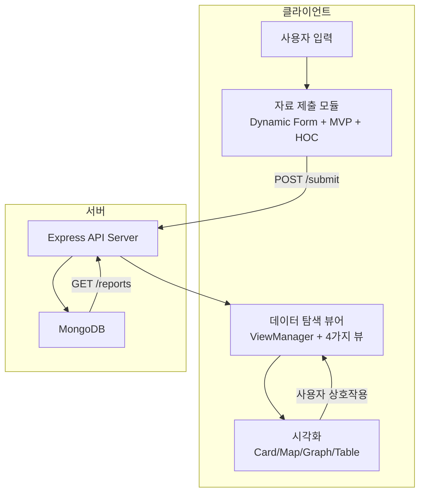
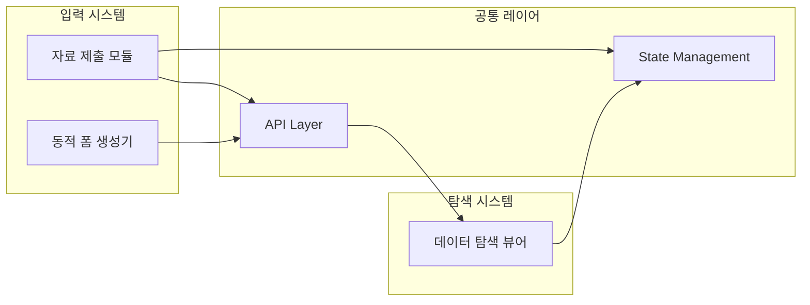
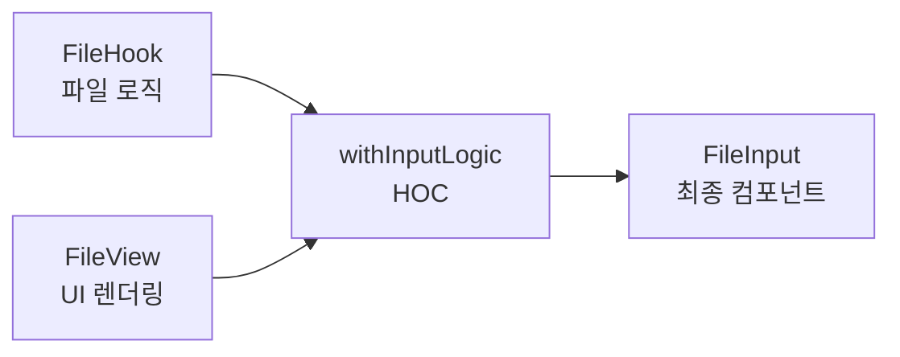
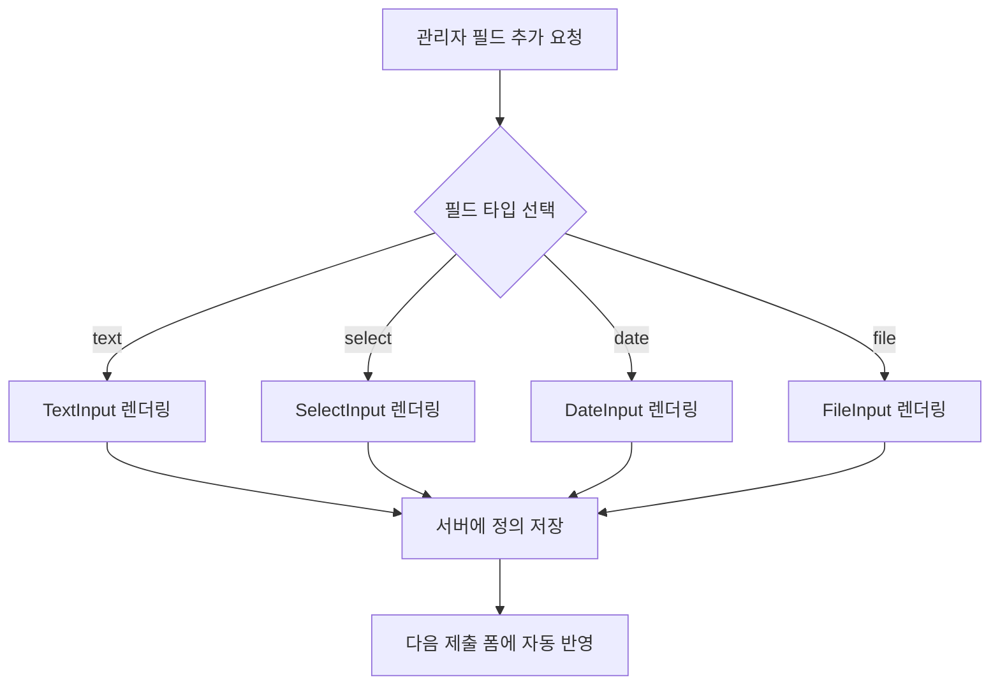
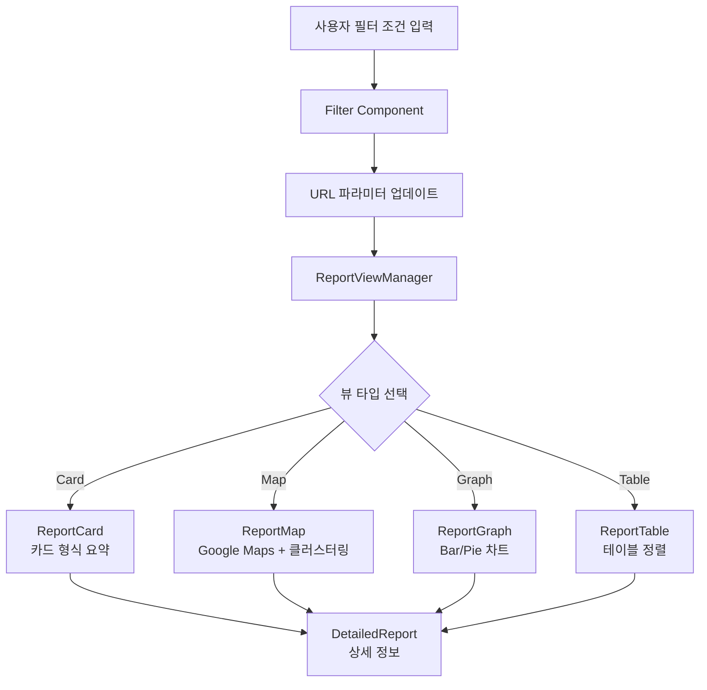

# 오션클라우드 (Ocean Cloud) - 동적 입력 및 데이터 탐색 플랫폼

---

## Executive Summary

환경 데이터 수집 플랫폼에서 **서버 정의 기반 동적 입력 시스템**을 구축하여, 입력 항목 변경 시 프론트엔드 재배포 없이 확장 가능한 구조를 달성했습니다. MVP + HOC 패턴으로 입력 로직과 UI를 완전 분리하여 변경의 파급 범위를 예측 가능하게 만들었으며, Google Maps 클러스터링 기반 4가지 시각화 뷰로 대량 데이터 탐색 UX를 개선했습니다. Context API와 URL 상태 동기화를 통해 일관된 필터링 환경을 제공하고, Hook-View-HOC 3단 분리 구조로 코드 리뷰 효율성을 향상시켰습니다. **모든 구조적 결정은 '변경에 강한 시스템'을 목표로 설계되었습니다.**

---

## 프로젝트 개요

### 목표 및 배경

쓰레기 수거 현장 데이터를 체계적으로 수집하고, 수집된 정보를 다양한 관점에서 분석할 수 있는 웹 플랫폼 구축이 목표였습니다. 현장 수거 인력은 위치, 사진, 수량 등을 입력하고, 관리자는 이를 지도, 그래프, 테이블 등 다양한 방식으로 탐색할 수 있어야 했습니다.

### 프로젝트 규모

- **사용자**: 400-500명 회원 대상 운영  
- **기간**: 2021-2024 (데브구루 재직 중)  
- **역할**: 프론트엔드 아키텍처 설계 및 구현 중심, 백엔드 API 설계 및 연동  

### 기술 스택

- **프론트엔드**: React (Hooks), Context API, HOC 패턴  
- **백엔드**: Express (API 설계 및 구현)  
- **DB**: MongoDB  
- **시각화**: Google Maps API (Marker Clustering), Recharts  
- **상태 관리**: Context API, URL State Synchronization  
- **기타**: Geolocation API, CSV Export  

---

## 핵심 설계 원칙

### 1. 책임 기반 분리 (Separation of Concerns)

각 레이어가 하나의 관심사만 담당하도록 설계하여, 변경 시 수정 범위를 최소화하고 파급 효과를 예측 가능하게 만들었습니다.

**적용 예시:**
- **입력 모듈**: Hook(로직) - View(UI) - HOC(결합) 3단 분리  
- **탐색 모듈**: Filter(조건 설정) - ViewManager(뷰 분기) - View(렌더링) 계층 구성  

**개발 경험(DX) 개선 효과:**
- 새 입력 타입 추가: Hook만 작성 (기존 컴포넌트 수정 불필요)  
- UI 스타일 변경: View만 수정 (로직 영향 없음)  
- 공통 로직 개선: HOC만 수정 (모든 입력 컴포넌트 일괄 반영)  

---

### 2. 동적 확장성 (Dynamic Extensibility)

런타임 정의 기반으로 코드 수정 없는 확장을 지원하여, 비즈니스 요구사항 변화에 빠르게 대응할 수 있도록 설계했습니다.

**적용 예시:**
- **입력 모듈**: 서버 JSON 기반 필드 자동 생성  
- **폼 생성기**: 타입별 컴포넌트 자동 매핑 (text, select, date 등)  

**확장 시나리오:**
신규 입력 항목 추가 → 서버 JSON 정의 추가 → 프론트엔드 자동 렌더링 (재배포 불필요)

---

### 3. 상태 동기화 (State Synchronization)

일관된 상태 관리 전략으로 데이터 정합성을 확보하고, 사용자 경험의 일관성을 유지했습니다.

**적용 예시:**
- **입력 모듈**: Context API로 GPS, 파일, 날짜 등 전역 상태 관리  
- **탐색 모듈**: URL 파라미터로 필터 상태 동기화 (공유 가능한 링크 생성)  

**동기화 전략의 이점:**
- 브라우저 새로고침 시 필터 상태 유지  
- 특정 조건의 데이터 뷰를 URL로 공유 가능  
- 뒤로 가기/앞으로 가기 버튼으로 탐색 이력 추적  

---

## 시스템 아키텍처

### 전체 데이터 흐름



---

### 모듈 간 관계



---

## [1] 자료 제출 모듈 (Data Submission)

사용자가 현장에서 데이터를 제출하는 입력 중심 모듈로, 동적 폼 구조와 MVP 패턴을 결합하여 확장성과 재사용성을 동시에 확보했습니다.

---

### Problem

현장 상황에 따라 입력 항목이 자주 변경되었습니다. 새로운 분류 기준이 추가되거나, 측정 단위가 바뀔 때마다 프론트엔드 컴포넌트를 수정하고 재배포해야 했습니다. 입력 필드가 증가하면서 중복 로직이 누적되고, 하나의 수정이 다른 필드에 영향을 주는 문제가 발생했습니다.

---

### Solution

**1) 서버 정의 기반 동적 렌더링**

서버에서 폼 구조를 JSON으로 정의하고, 클라이언트는 이를 파싱해 런타임에 필드를 자동 생성했습니다.

```json
// 서버에서 전달받는 폼 정의 예시
{
  "fields": [
    { "type": "gps", "label": "위치", "required": true },
    { "type": "file", "label": "사진", "maxCount": 5 },
    { "type": "select", "label": "분류", "options": [...] }
  ]
}
```

**2) Hook-View-HOC 3단 분리 구조**

각 입력 컴포넌트를 세 개의 독립적 레이어로 분리:  
- **Hook**: 로직 및 유효성 검증  
- **View**: UI 및 접근성 처리  
- **HOC**: 공통 로직 결합 및 추상화  



**3) Context 기반 중앙 상태 관리**

GPS, 파일, 날짜 등 여러 필드가 참조하는 공통 상태를 Context API로 일원화했습니다.

---

### Outcome

- **배포 주기 단축**: 서버 정의만 수정 → 프론트엔드 재배포 불필요  
- **변경 파급 최소화**: Hook만 수정하면 로직 변경 완료  
- **리뷰 효율성 개선**: Hook(로직) / View(UX) 검토 분리  
- **재사용성 확보**: 신규 타입 추가 시 Hook만 작성  

**구현된 입력 필드:**  
GPS (자동 위치 수집), File (다중 파일, 미리보기, 확장자 검증), CustomDate (날짜/시간), Select (동적 옵션), Checkbox, Size, Text 등

---

## [2] 동적 폼 생성기 (Form Builder)

관리자가 새로운 수집 시나리오에 맞게 입력 폼을 구성할 수 있는 관리자용 모듈입니다.

---

### Problem

입력 폼 구성이 비유연적이었으며, 새로운 항목 추가 시마다 개발팀의 코드 수정과 배포가 필요했습니다.

---

### Solution

**1) Add-only 구조 설계**

기존 항목의 수정 대신 "누적" 방식으로 신규 필드 추가를 허용해, 데이터 정합성과 히스토리 추적 가능성을 확보했습니다.

**설계 배경:**  
- 기존 항목 수정 시 과거 데이터와 스키마 불일치 발생  
- 신규 항목 추가는 기존 데이터에 영향 없음  
- 데이터 히스토리 추적 및 롤백 가능성 확보  

**2) 타입 기반 컴포넌트 자동 매핑**

입력 타입(text, select, date 등)에 따라 자동으로 UI를 렌더링하도록 설계했습니다.



---

### Outcome

- **무코드 확장성**: 관리자가 직접 폼 구성 가능  
- **데이터 안정성**: 기존 스키마 불변 유지  
- **운영 효율성**: 개발 개입 및 배포 사이클 제거  

---

## [3] 데이터 탐색 뷰어 (Visualization Platform)

사용자가 수집된 데이터를 시각적으로 탐색하고 분석할 수 있는 모듈입니다.

---

### Problem

데이터가 많아지면서 원하는 항목을 찾기 어려워졌고, 지도·그래프·테이블 등 다양한 시각화 요구를 단일 뷰로 충족하기 어려웠습니다.

---

### Solution

**1) 다중 시각화 뷰 제공**

Card / Map / Graph / Table의 4가지 뷰를 구성하여 사용자 선호에 따라 선택 가능하도록 설계했습니다.



---

**2) Google Maps 클러스터링**

데이터 밀집 지역을 클러스터 단위로 표시하여 시각적 노이즈를 제거했습니다.

**3) URL 상태 동기화**

필터 조건을 URL 파라미터에 반영해 공유 가능성을 확보했습니다.

```
// URL 예시
/reports?view=map&category=plastic&date=2024-01&region=seoul
```

---

### Outcome

- **탐색 효율 향상**: 지도 클러스터링으로 지리적 패턴 즉시 파악  
- **사용자 맞춤화**: 뷰 모드별 선택적 탐색  
- **협업 용이성**: URL 기반 필터 공유 가능  
- **브라우저 통합**: 뒤로 가기/앞으로 가기로 탐색 이력 추적  

---

## 기여 및 성과

### 전체 시스템 기여

**아키텍처 설계**
- MVP + HOC 패턴 기반 입력 시스템 설계 및 표준화  
- Hook-View-HOC 3단 분리 구조 확립  
- Context API 기반 전역 상태 관리 전략 수립  

**핵심 인프라**
- 서버 정의 기반 동적 렌더링 엔진 개발  
- API 통신 레이어 설계 및 구현  
- URL 상태 동기화 시스템 구현  

**개발 경험(DX) 개선**
- 변경의 파급 범위를 예측 가능하게 만드는 구조 확립  
- 코드 리뷰 시 검토 포인트 자동 분리 (Hook: 로직, View: UX)  
- 신규 기능 추가 시 수정 범위 최소화  

---

### 모듈별 기여

**자료 제출 모듈**
- GPS, 파일, 날짜 등 고급 입력 컴포넌트 구현  
- Geolocation API 연동 및 자동 위치 수집  
- 이미지 업로드, 미리보기, 확장자 검증 로직 구현  
- 실시간 유효성 검사 시스템 구축  

**동적 폼 생성기**
- Add-only 구조 설계 및 구현  
- 타입 기반 컴포넌트 자동 매핑 시스템 개발  
- 관리자용 폼 구성 인터페이스 구현  

**데이터 탐색 뷰어**
- Google Maps 클러스터링 구현  
- 4가지 시각화 뷰 (Card/Map/Graph/Table) 개발  
- URL 필터 상태 동기화 로직 설계 및 구현  
- CSV Export 기능 구현  

---

### 정량적 성과

| 항목 | Before | After | 개선 효과 |
|------|--------|--------|------------|
| 신규 입력 타입 추가 | 신규 컴포넌트 + 전체 폼 수정 (0.5~1일) | Hook 추가만 (1~2시간) | 약 75% 단축 |
| 배포 주기 | 코드 수정 + 빌드 필요 | 서버 정의만 수정 | 무배포 확장 |
| 코드 리뷰 | UI·로직 혼재로 검토 포인트 불명확 | Hook/View 분리로 검토 포인트 자동 분리 | 리뷰 효율 체감 향상 |

---

### 정성적 성과

- **구조적 안정성**: 변경 영향 범위를 파일 단위로 예측 가능  
- **협업 효율성**: 리뷰 범위 명확화 및 병렬 검토 가능  
- **유지보수성**: 로직·UI 독립 수정으로 사이드이펙트 최소화  

이 구조적 분리는 개발 효율성뿐 아니라, 장기적인 유지보수 비용 절감과 기능 확장의 예측 가능성을 높이는 결과로 이어졌습니다.

---

## 프로젝트 핵심 요약 (Self-Review)

**문제 인식**

입력 요구사항이 자주 변경되고, 수집된 대량 데이터의 탐색 효율이 낮았습니다. 하나의 수정이 예기치 않은 영향으로 이어지는 구조적 불안정성이 존재했습니다.

**설계 결정**

MVP + HOC 패턴을 적용하여 로직(Hook)·UI(View)·결합(HOC)을 완전히 분리했고, 서버 정의 기반 렌더링으로 무배포 확장성을 확보했습니다. Context API와 URL 동기화로 상태 일관성을 유지했습니다.

**구현 전략**

Hook은 입력 로직, View는 UI와 접근성, HOC는 공통 로직을 담당했습니다. 폼 정의를 서버 JSON으로 관리하여 런타임에 자동 생성하고, URL 파라미터를 통해 브라우저 히스토리와 동기화했습니다.

**결과**

Hook 추가만으로 신규 입력 타입을 확장할 수 있었으며, 4가지 시각화 뷰와 URL 공유 기능으로 탐색 편의성을 개선했습니다. 변경의 영향 범위를 명확히 예측할 수 있는 구조를 확보했습니다.

**에필로그**

이 프로젝트는 **"구조를 설계함으로써 복잡성을 제어한다"** 는 제 개발 철학의 출발점이 되었습니다.
