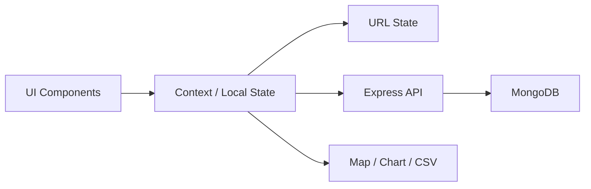
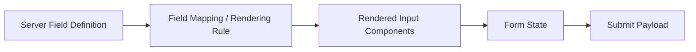
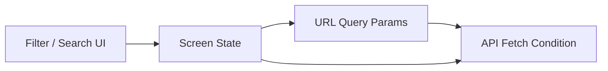
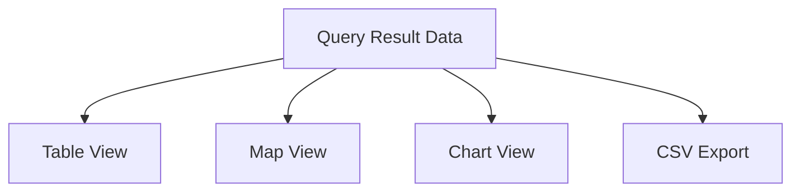

# Architecture

## 문서 목적

이 문서는 Ocean Cloud에서 입력, 조회, 시각화 기능을 어떻게 나누고 연결했는지, 그리고 화면 상태와 API 흐름을 어떤 기준으로 정리했는지를 설명합니다.

기능이 늘어날수록 화면, 상태, API, 데이터 저장 방식이 함께 복잡해지는 웹 프로젝트였습니다.
이 문서에서는 실제 웹 기능을 계속 확장할 수 있도록 화면과 상태를 어떤 방식으로 나누었는지에 집중합니다.

## 설계에서 중요했던 기준

Ocean Cloud에서 중요했던 기준은 다음과 같았습니다.

- 입력 화면이 항목 변경마다 전체 수정으로 번지지 않을 것
- 조회 조건과 화면 상태가 분리되지 않고 연결될 것
- 지도, 차트, CSV Export 같은 기능이 탐색 흐름 위에 자연스럽게 붙을 것
- 프론트엔드 상태와 URL, API 요청 조건이 서로 어긋나지 않을 것
- 프론트엔드와 백엔드가 입력/조회 흐름을 같은 기준으로 바라볼 것

즉, 이 프로젝트의 핵심은 기능 하나를 잘 만드는 것보다, 입력과 탐색을 중심으로 여러 기능을 계속 붙일 수 있는 웹 구조를 만드는 일이었습니다.

## 전체 구성

Ocean Cloud의 큰 흐름은 다음과 같이 정리할 수 있습니다.

* 사용자는 화면에서 입력하거나 조회 조건을 바꿉니다.
* 상태는 화면 내부와 Context를 통해 관리됩니다.
* 중요한 탐색 조건은 URL과 동기화됩니다.
* API는 그 조건을 기준으로 데이터를 조회하거나 저장합니다.
* 결과 데이터는 테이블, 지도, 차트, CSV 형태로 다시 연결됩니다.

이 구조에서 중요한 것은 기능을 따로 만드는 것이 아니라, 입력과 조회 흐름 위에서 상태와 시각화가 어긋나지 않게 유지하는 것이었습니다.

## 화면 구성 관점

Ocean Cloud는 크게 세 가지 축으로 이해할 수 있습니다.

### 1. 입력 화면

자료를 등록하기 위한 화면입니다.
고정된 화면별 폼을 계속 늘리는 대신, 서버 정의를 바탕으로 입력 항목을 조립하는 방식으로 구현했습니다.

### 2. 탐색 화면

저장된 자료를 조건에 따라 조회하고 좁혀 가는 화면입니다.
단순 목록 출력이 아니라, 필터 조건과 검색 흐름을 계속 바꾸며 데이터를 확인할 수 있도록 구성했습니다.

### 3. 시각화/활용 기능

탐색된 결과를 지도, 차트, CSV Export 형태로 다시 활용하는 영역입니다.
이 기능들은 입력이나 조회와 분리된 부가기능이 아니라, 같은 데이터 흐름 위에서 동작하도록 연결했습니다.

## 동적 입력 구조

입력 화면은 화면마다 고정 JSX를 반복하는 방식보다, 서버가 내려주는 정의를 기준으로 필드를 구성하는 방식으로 구현했습니다.

이 구조에서 중요했던 점은 다음과 같습니다.

* 필드 종류와 속성을 서버 정의 기준으로 처리
* 화면은 정의를 해석해 적절한 입력 컴포넌트를 렌더링
* 입력 상태는 공통 규칙으로 관리
* 제출 시에는 다시 API가 기대하는 형태로 변환

이 방식의 장점은 입력 항목이 바뀌어도 프론트엔드 화면 전체를 다시 수정하지 않고, 정의와 매핑 규칙 중심으로 대응할 수 있다는 점이었습니다.

## 탐색 흐름과 상태 관리

탐색 기능은 단순히 조건 몇 개를 넣고 조회하는 수준이 아니라, 사용자가 여러 조건을 바꾸며 데이터를 좁혀 가는 흐름이 중요했습니다.
그래서 Ocean Cloud에서는 화면 상태를 단순 컴포넌트 내부 state에만 두지 않고, Context와 URL 동기화를 함께 사용했습니다.

### 상태 관리에서 다룬 요소

* 현재 필터 조건
* 정렬/페이지/선택 상태
* 지도/차트/리스트 전환 상태
* 조회 결과
* 로딩 및 오류 상태

이 상태를 한 곳에 몰아넣는 대신, 화면 흐름상 같이 움직여야 하는 상태와 독립적으로 변하는 상태를 나누어 다루는 것이 중요했습니다.

## URL State Synchronization

탐색 화면에서는 URL과 상태를 맞추는 것이 중요했습니다.
그래야 사용자가 조건을 바꾼 뒤 새로고침하거나 링크를 공유해도, 같은 조회 상태를 다시 열 수 있기 때문입니다.

이 구조를 통해 다음을 얻을 수 있었습니다.

* 화면 새로고침 후에도 탐색 상태 유지
* 특정 조회 조건을 URL로 공유 가능
* UI 상태와 API 요청 조건의 불일치 감소

즉, URL은 단순 주소가 아니라 탐색 상태의 일부로 다뤘습니다.

## 시각화 기능 연결

지도, 차트, CSV Export는 각각 별도 기능처럼 보이지만, Ocean Cloud에서는 모두 같은 탐색 결과를 기반으로 동작하도록 연결했습니다.

이 연결 방식의 핵심은 데이터 소스를 분리하지 않는 것이었습니다.
조회 결과가 정리되면, 같은 데이터를 테이블로도 보고 지도에도 올리고 차트로도 표현할 수 있어야 했습니다.

이 구조 덕분에 다음이 가능했습니다.

* 같은 조회 결과를 여러 방식으로 활용
* 시각화 기능 추가 시 API를 새로 만들지 않고 확장 가능
* 화면 기능이 늘어나도 데이터 흐름 기준은 유지

## 백엔드와 데이터 구조

백엔드에서는 Express를 사용해 입력과 조회 흐름을 지원하는 API를 설계했고, MongoDB를 통해 자료를 저장하고 조회했습니다.

여기서 중요한 것은 단순 CRUD API보다, 프론트엔드가 다루는 입력 정의와 조회 조건을 실제 저장/조회 구조와 어떻게 맞출 것인가였습니다.

### 백엔드에서 중요했던 역할

* 입력 데이터 저장 API
* 조회 조건 기반 검색 API
* 시각화/Export에 재사용 가능한 결과 제공
* 화면 상태와 어긋나지 않는 응답 구조 유지

즉, 프론트엔드와 백엔드는 분리된 기능이 아니라, 하나의 입력/탐색 흐름을 양쪽에서 나누어 담당하는 관계였습니다.

## 사용 기술과 역할

| 영역     | 기술                | 역할                |
| ------ | ----------------- | ----------------- |
| 프론트엔드  | React Hooks       | 화면 로직과 컴포넌트 상태 구성 |
| 프론트엔드  | Context API       | 화면 간 공유 상태 관리     |
| 프론트엔드  | HOC 패턴            | 공통 로직 재사용 및 책임 분리 |
| 백엔드    | Express           | 입력/조회 API 설계 및 구현 |
| 데이터 저장 | MongoDB           | 자료 저장 및 조건 기반 조회  |
| 시각화    | Google Maps API   | 위치 기반 데이터 표시      |
| 시각화    | Marker Clustering | 지도 데이터 밀집 표현      |
| 시각화    | Recharts          | 차트 시각화            |
| 상태 관리  | URL State Sync    | 탐색 상태와 URL 일치     |
| 기타     | CSV Export        | 조회 결과 외부 활용       |
| 기타     | Geolocation API   | 위치 기반 기능 연결       |

## 이 문서에서 말하고 싶은 핵심

Ocean Cloud의 구조는 거대한 프레임워크를 만든다는 의미의 아키텍처라기보다, 웹 기능이 늘어날수록 입력, 탐색, 상태, 시각화가 서로 충돌하지 않도록 흐름을 정리한 방식에 가깝습니다.

정리하면 핵심은 다음과 같습니다.

* 입력 항목 변경이 화면 전체 수정으로 번지지 않도록 한 점
* 탐색 상태와 URL, API 요청 조건을 연결한 점
* 조회 결과를 테이블, 지도, 차트, CSV로 확장 가능하게 만든 점
* 프론트엔드와 백엔드가 같은 입력/조회 흐름을 바라보도록 맞춘 점

## 다음 문서

이 문서는 Ocean Cloud의 기능 구조와 상태 흐름을 기술 관점에서 정리한 문서입니다.
프로젝트 전체 배경과 기능 범위는 [Overview](./Overview.md) 문서에서 설명합니다.
